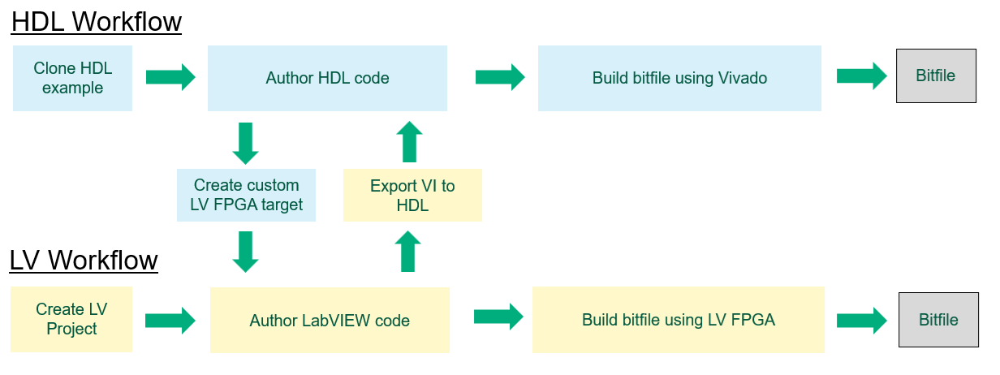

# FlexRIO Custom

This repository contains examples of customized FlexRIO FPGA devices.  These examples use the [LabVIEW FPGA HDL Tools](https://github.com/ni/labview-fpga-hdl-tools)
([PyPI](https://pypi.org/project/labview-fpga-hdl-tools)) to manage dependencies, generate
Vivado projects, and integrate custom HDL with LabVIEW.

**Table of Contents**

- [How can I use this to customize a FlexRIO board?](#how-can-i-use-this-to-customize-a-flexrio-board)
- [Supported Devices](#supported-devices)
- [System Setup](#system-setup)
- [Getting Started](#getting-started)
- [How you customize a FlexRIO board](#how-you-customize-a-flexrio-board)
- [Reference & deep-dive (LabVIEW FPGA HDL Tools)](#reference--deep-dive-labview-fpga-hdl-tools)
- [Repo Folder Hierarchy](#repo-folder-hierarchy)

 

# How can I use this to customize a FlexRIO board?

There are **three** ways to customize a FlexRIO board and build an FPGA bitfile:

### 1) HDL-only
Do your design in VHDL inside `UserHdl`, compile the bitfile in Vivado, and talk to it from
the host over **registers and DMA FIFOs** through the NI-RIO driver. There is no LabVIEW FPGA
VI in the stack. **Start at [Getting Started → Exercise 1](docs/GettingStarted.md#exercise-1---build-a-bitfile-hdl-only-flow).**

### 2) Custom LabVIEW FPGA Target - build in LabVIEW FPGA
Package your HDL as a **custom LabVIEW FPGA target**, then finish the design in a LabVIEW FPGA
VI and use the standard LabVIEW FPGA bitfile-generation workflow. **Start at
[Getting Started → Exercise 2](docs/GettingStarted.md#exercise-2---create-a-custom-labview-fpga-target).**
Requires **LabVIEW 2026 or newer**.

### 3) Custom LabVIEW FPGA Target - build in Vivado
Follow the same path as #2 but then **export** your top-level LabVIEW FPGA VI to a VHDL netlist.  Then bring that netlist into the HDL and Vivado build flow as an IP component to iterate and build as you did in #1.

> **Already have a socketed CLIP?** You can bring an existing socketed CLIP into this new
> HDL development workflow. See the
> [CLIP Migration Hands-On Guide](docs/CLIPMigrationHandsOnGuide.md) (also Exercise 3 in
> Getting Started).

Every target centers on **[`rtl-lvfpga/UserHdl.vhd`](targets/pxie-7903custom/rtl-lvfpga/UserHdl.vhd)**
— the entity you extend with your custom logic. Its ports expose the host **registers** and
**DMA FIFOs** (and the board IO); everything else in a target is scaffolding that supports it.
The register and DMA-FIFO building blocks you instantiate in `UserHdl` — with step-by-step
instantiation guides — live in **[hdl-shared](https://github.com/ni/hdl-shared)**.

**For the full picture** — what you're actually customizing, socketed-CLIP background, customization approaches in depth, and per-device **IO Module IDs** — see
**[Customizing a FlexRIO Board](docs/CustomizingAFlexRIOBoard.md)**.

> New to the architecture? Read the
> [Theory of Operation](https://github.com/ni/labview-fpga-hdl-tools/blob/main/docs/TheoryOfOperation.md)
> for the concepts behind the two compile flows, then come back here to run the exercises.

 

# Supported Devices

This is the support matrix for the custom HDL workflow, organized the same way FlexRIO
modules are grouped in the LabVIEW **new FPGA target** dialog. For each device it shows
how far the new workflow has come — from a complete worked example, to "you can build it
yourself today," to "not available in the new workflow yet."

**Status definitions**

| Status | Meaning |
| --- | --- |
| ✅ **Supported** | A customizable custom target ships in this repo (for IO-module devices, a complete worked example) — clone it and build. |
| 🟨 **Buildable (no example yet)** | The baseboard custom target **and** the IO-module CLIP are both available, but no bespoke example wires them together. Build it yourself by starting from the baseboard's custom target and following the [CLIP Migration Hands-On Guide](docs/CLIPMigrationHandsOnGuide.md). |

## FlexRIO Coprocessor Modules

Coprocessor modules have no integrated IO module, so they need no IO-module CLIP. Each
ships as a customizable custom target — start from its target folder. The **PXIe-7903**
can additionally drive a digital frontend using the **Aurora** or **100 GbE** CLIPs.

| Device | Status |
| --- | --- |
| PXIe-7903 | ✅ Supported — customizable target (Aurora frontend example `pxie-7903aurora`; 100 GbE CLIP available) |
| PXIe-7903-DDR1280 | ✅ Supported — customizable target |
| PXIe-7911 | ✅ Supported — customizable target |
| PXIe-7912 | ✅ Supported — customizable target |
| PXIe-7915 | ✅ Supported — customizable target |

## FlexRIO FPGA Modules

FPGA modules are baseboards with no integrated IO — you add your own IO in `UserHdl`.
Each one now ships as a customizable custom target — start from its target folder. The
**PCIe-798x** rows are the PCIe form-factor (Garrison) equivalents of the Macallan modules;
the **PXIe-799x** rows are the BTrace family (PXIe-7993 is the Blackadder baseboard).

| Device | Status |
| --- | --- |
| PXIe-7981 | ✅ Supported — customizable target |
| PXIe-7982 | ✅ Supported — customizable target |
| PXIe-7985 | ✅ Supported — customizable target |
| PXIe-7986 | ✅ Supported — customizable target |
| PXIe-7990 | ✅ Supported — customizable target |
| PXIe-7991 | ✅ Supported — customizable target |
| PXIe-7992 | ✅ Supported — customizable target |
| PXIe-7993 | ✅ Supported — customizable target |
| PXIe-7994 | ✅ Supported — customizable target |
| PCIe-7981 | ✅ Supported — customizable target |
| PCIe-7982 | ✅ Supported — customizable target |
| PCIe-7985 | ✅ Supported — customizable target |

## FlexRIO Digital Modules

| Device | Baseboard | Status |
| --- | --- | --- |
| PXIe-6569 | PXIe-7991 / PXIe-7992 | 🟨 Buildable — CLIP available, no example yet |

## FlexRIO High-Speed Serial Modules

| Device | Baseboard | Status |
| --- | --- | --- |
| PXIe-6593 (KU40) | PXIe-7982 | 🟨 Buildable — CLIP available, no example yet |
| PXIe-6593 (KU60) | PXIe-7985 | 🟨 Buildable — CLIP available, no example yet |
| PXIe-6594 | PXIe-7986 | 🟨 Buildable — CLIP available, no example yet |

## FlexRIO Multifunction IO Modules

| Device | Baseboard | Status |
| --- | --- | --- |
| PXIe-7890 | PXIe-7994 | 🟨 Buildable — CLIP available, no example yet |
| PXIe-7891 | PXIe-7994 | 🟨 Buildable — CLIP available, no example yet |

## FlexRIO FPD-Link Interface Modules

| Device | Baseboard | Status |
| --- | --- | --- |
| PXIe-1486 / PXIe-1487 | PXIe-7993 | 🟨 Buildable — CLIP available, no example yet |
| PXIe-1488 / PXIe-1489 | PXIe-7993 | 🟨 Buildable — CLIP available, no example yet |

## FlexRIO Digitizer and Transceiver Modules

These analog instrument modules run on the Macallan FPGA modules (PXIe-7981 / 7982 / 7985)
and are customized through their socketed CLIP, just like the other IO modules.

| Device | Baseboard | Status |
| --- | --- | --- |
| PXIe-5763 / PXIe-5764 | PXIe-7981 / 7982 / 7985 | 🟨 Buildable — CLIP available, no example yet |
| PXIe-5785 / PXIe-5775 / PXIe-5745 | PXIe-7981 / 7982 / 7985 | 🟨 Buildable — CLIP available, no example yet |
| PXIe-5774 | PXIe-7982 / 7985 | 🟨 Buildable — CLIP available, no example yet |

 

# System Setup

Follow these steps once to set up your machine to use the LabVIEW FPGA HDL Tools with this
`flexrio-custom` repository (plus `nisetup` once per terminal).

## Prerequisite Software

Use **NI Package Manager** to install the following:

* **LabVIEW** 2023 or newer
* **LabVIEW FPGA Module** 2023 or newer
* **LabVIEW FPGA Compilation Tool for Vivado 2021.1** 
* **FlexRIO** 2026 Q3 or newer

> **LabVIEW 2026+ for the LabVIEW FPGA target flow.** Building a bitfile *in LabVIEW FPGA*
> (Exercise 2 / the custom LabVIEW FPGA target flow) requires **LabVIEW 2026 or newer**. The
> HDL-only Vivado flow works with LabVIEW 2023+.

Install the following third-party software:

* **Git** (latest) – https://git-scm.com/downloads
* **Python** 3.10 or newer (tested with 3.10–3.14) – https://www.python.org/downloads/

> **ModelSim is optional.** Only the ModelSim simulation flow needs it, and `nihdl` cannot
> install it for you. If you don't have ModelSim, you can still complete every exercise
> except simulation.

## 1) Clone this repo
In a dev folder (e.g. `c:\dev\github`) clone the repo:
> git clone https://github.com/ni/flexrio-custom

List tags for all the releases:
> git tag

Checkout the repo at a specific tag/version:
> git checkout tags/26.x.y

(the `main` branch may be unstable; we recommend checking out the latest version that does not have "dev" in the name)

## 2) Go to the custom target folder
> cd C:\dev\github\flexrio-custom\targets\pxie-7903custom

All command-line operations are performed from within a target folder.

## 3) Set up the Python environment
> nisetup

This creates a virtual environment, installs the correct version of the LabVIEW FPGA HDL Tools, and activates the environment.

> **Terminal note.** `nisetup` works in both **Windows Command Prompt** and **PowerShell**
> (PowerShell is the default terminal in VS Code) — run it in whichever shell you use. You
> will see `(flexrio-custom)` in your prompt when the environment is active. **Re-run
> `nisetup` in every new terminal** — the environment is only active for the current session.

## 4) See the list of available commands
> nihdl --help

## 5) Install dependencies
> nihdl install-deps

This downloads the dependencies specified in the `dependencies.toml` file at the repo root
(`C:\dev\github\flexrio-custom\dependencies.toml`) into the `deps/` folder. You do **not**
clone those repositories yourself — the tool clones them for you. For reference, the
dependencies come from [flexrio](https://github.com/ni/flexrio),
[flexrio-deps](https://github.com/ni/flexrio-deps),
[flexrio-clips](https://github.com/ni/flexrio-clips), and
[hdl-shared](https://github.com/ni/hdl-shared).

 
<b>That's it! Your computer is set up to use the LabVIEW FPGA HDL Tools to make custom FlexRIO FPGA devices.</b>

 

# Getting Started

Step-by-step exercises for building bitfiles, customizing a target, and migrating a socketed
CLIP live in **[docs/GettingStarted.md](docs/GettingStarted.md)**. New users should start
there after completing System Setup above.

 

# Reference & deep-dive

The workflows above are all you need to get building. When you want command details,
settings, or the concepts behind the tools, use the **LabVIEW FPGA HDL Tools**
documentation — the reference manual for the `nihdl` toolchain. **It is a reference, not a
starting point.**

| Topic | Doc |
| --- | --- |
| Concepts — the architecture and the two compile flows | [Theory of Operation](https://github.com/ni/labview-fpga-hdl-tools/blob/main/docs/TheoryOfOperation.md) |
| Every `nihdl` command and option | [Command Reference](https://github.com/ni/labview-fpga-hdl-tools/blob/main/docs/CommandReference.md) |
| The `nihdlsettings.py` model and setters | [Settings Reference](https://github.com/ni/labview-fpga-hdl-tools/blob/main/docs/SettingsReference.md) |
| Flow walkthroughs (command + option reference for each) | [Vivado](https://github.com/ni/labview-fpga-hdl-tools/blob/main/docs/VivadoCompileFlow.md) · [LabVIEW FPGA target](https://github.com/ni/labview-fpga-hdl-tools/blob/main/docs/LabVIEWFpgaTargetFlow.md) · [ModelSim](https://github.com/ni/labview-fpga-hdl-tools/blob/main/docs/ModelSimSimulationFlow.md) |
| Custom I/O CSV · generated VHDL · window & constraints | [LVTargetBoardIO.csv](https://github.com/ni/labview-fpga-hdl-tools/blob/main/docs/LVTargetCustomIO-Reference.md) · [Generated VHDL](https://github.com/ni/labview-fpga-hdl-tools/blob/main/docs/GeneratedVHDL.md) · [Window & Constraints](https://github.com/ni/labview-fpga-hdl-tools/blob/main/docs/WindowNetlistAndConstraints.md) |

**Host-interface HDL** — the register and DMA-FIFO blocks you instantiate in `UserHdl` — lives in
[hdl-shared](https://github.com/ni/hdl-shared):
[register overview](https://github.com/ni/hdl-shared/blob/main/host_interfaces/register/docs/README.md) ·
[register instantiation guide](https://github.com/ni/hdl-shared/blob/main/host_interfaces/register/docs/instantiation-guide.md) ·
[DMA-FIFO overview](https://github.com/ni/hdl-shared/blob/main/host_interfaces/fifo/docs/README.md) ·
[DMA-FIFO instantiation guide](https://github.com/ni/hdl-shared/blob/main/host_interfaces/fifo/docs/instantiation-guide.md) ·
[FIFO CDC constraints](https://github.com/ni/hdl-shared/blob/main/host_interfaces/fifo/xdc/HDL_FIFO_CDC_CONSTRAINTS.md).

Repo-local task guides: [Getting Started](docs/GettingStarted.md) ·
[Talk to the bitfile from a host VI](docs/HostVIsAndBitfiles.md) ·
[Digital IO](docs/DigitalIO.md) ·
[Dependencies and File Management](docs/DependenciesAndFileManagement.md) ·
[Troubleshooting / FAQ](docs/Troubleshooting.md)

Advanced (contributor): [Creating a FlexRIO Baseboard Custom Target](docs/CreatingABaseboardCustomTarget.md) — stand up a brand-new `<device>custom` example from a released base target.

 

# Repo Folder Hierarchy

* Root repo folder
    * `.github` - CI workflows and repo automation
    * `deps` - checked-out GitHub dependencies installed by `nihdl install-deps`
    * `docs` - repository documentation
    * `targets` - FPGA target projects (one folder per supported device)
        * `common` - shared files used across the target projects
        * `pxie-7903custom` - example custom PXIe-7903 device (consider this to be the "Hello World" example)
            * `nihdlsettings.py` - tool configuration (Python-based target settings)
            * `nisetup.bat` - runs the repo-root setup script to activate the Python environment
            * `lvFpgaTarget` - LabVIEW FPGA target plugin source files
            * `blankLvWindowNetlist` - placeholder LabVIEW window netlist content
            * `rtl-lvfpga` - target HDL sources
                * `UserHdl.vhd` - the entity you extend with your custom HDL; its ports expose the host registers and DMA FIFOs
            * `xdc` - timing constraints
            * `VivadoProject` - Vivado project files (ignored in .gitignore)
            * `ModelSimProject` - ModelSim simulation project files (ignored in .gitignore)
            * `objects` - generated outputs from HDL tools (ignored in .gitignore)
            * `docs` - target-specific documentation and examples
            * `vivadoprojectsources.txt` - source list used for Vivado project generation
            * `vivadoprojectexclude.txt` - files excluded from the generated Vivado project
            * `modelsimprojectsources.txt` - source list used for ModelSim project generation
        * `pxie-7903aurora` - example of migrating the Aurora CLIP to make a custom Aurora PXIe-7903 device
        * `pxie-7xxxCustom` - additional custom device examples
    * `tests` / `test-targets` - automated tests and test targets
    * `dependencies.toml` - dependency version specification for `nihdl install-deps` and Python tool versions
    * `nisetup.bat` - sets up a Python virtual environment and installs dependencies
    * `nisetup.py` - Python script that creates the venv and installs packages from `dependencies.toml`
    * `CONTRIBUTING.md`, `SECURITY.md`, `LICENSE` - project meta files

