# HDL Workflow Hands-On Guide

# Getting Started

This guide will take you through taking the base PXIe-7903 FlexRIO board and adding the Aurora CLIP to make it a custom FPGA device.

We recommend going through the material in the following order:

1. Look over the [PXIe-7903 architecture](https://github.com/ni/flexrio/blob/main/targets/pxie-7903/docs/public/PXie-7903%20Architecture.md)
2. Read the [LabVIEW FPGA HDL Tools Theory of Operation](https://github.com/ni/labview-fpga-hdl-tools/blob/main/docs/Theory%20of%20Operation.md)
3. Read the steps in this migration guide
    1. Don’t try to perform this workflow the first time through!  We recommend that you fully read the guide and then go through it again to execute the steps.
    2. When you reach a step that uses one of the tools (e.g. nihdl gen-vivado), refer to the [LabVIEW FPGA HDL Tools README](https://github.com/ni/labview-fpga-hdl-tools/blob/main/README.md) for details on the project settings and how the tool works
4. Perform the steps in this migration guide

# System Setup

## Install Git

Go to: [https://git-scm.com/downloads](https://git-scm.com/downloads)

Install the latest version

## Install Python

Go to: [https://www.python.org/downloads/](https://www.python.org/downloads/)

Install the latest version

If you are using PyEnv, configure it to use 3.11 or newer

## Create a GitHub development folder

Create a GitHub development folder on your computer:

```text
c:\dev\github
```

## Clone the flexrio-custom repo

Open a command prompt in that folder and clone the repo:

```text
git clone https://github.com/ni/flexrio-custom
```

This guide builds the Aurora CLIP example, so all command line operations are performed from within the Aurora target folder:

```text
C:\dev\github\flexrio-custom\targets\pxie-7903aurora
```

## Set up the Python environment

Open a command prompt in the target folder and run:

```text
nisetup
```

This creates a virtual environment, installs the correct version of the LabVIEW FPGA HDL Tools, and activates the environment.

**Important:** You must run `nisetup` every time you open a new command prompt.  The virtual environment is only active for the current terminal session.  You will see `(flexrio-custom)` in your command prompt when the environment is active.

Run the `nihdl --help` command to see the list of available commands:

```text
nihdl --help
```

## Install Dependencies

From the target folder, install the GitHub dependencies specified in dependencies.toml:

```text
nihdl install-deps
```

This clones the FlexRIO and shared HDL dependencies into the deps folder.  The dependency versions are specified in:

```text
C:\dev\github\flexrio-custom\dependencies.toml
```

## Create and Synthesize the Vivado Project

These steps will ensure that the GitHub repo and tools are properly setup.  Additionally, there are some files generated by the gen-vivado command that are used in later steps.

Run the gen-vivado command:

```text
nihdl gen-vivado
```

Run the launch-vivado command:

```text
nihdl launch-vivado
```

In Vivado, click the **Synthesize** button in the left-hand pane.

## Reference the Completed Example

This guide starts with the base PXIe-7903 (installed as a dependency under `deps/flexrio`) and modifies a custom target so that it contains the Aurora CLIP HDL in its top-level entity.

The completed result of every step in this guide is the checked-in `pxie-7903aurora` target:

```text
C:\dev\github\flexrio-custom\targets\pxie-7903aurora
```

As you work through the guide, you can compare your changes against the checked-in files (for example, with `git diff` or `git stash`) or browse them on GitHub:

[https://github.com/ni/flexrio-custom](https://github.com/ni/flexrio-custom)

Note: If you run the gen-vivado command before generating a LabVIEW FPGA netlist, the target uses the `blankLvWindowNetlist` so the design will still compile.  You will learn how to generate a real netlist in a later section.

## NI Software

Use NI Package Manager to install the following software.  This workflow has been tested with:

- LabVIEW 2023 (or newer) — tested with 2023, 2024, and 2025
- LabVIEW FPGA 2023 (or newer)
- LabVIEW FPGA Compilation tool for Vivado 2021.1
- FlexRIO 2026 Q3 (or newer)

# CLIP Migration Overview

The standard PXIe-7903 with Aurora interfaces uses the LabVIEW FPGA CLIP node to instantiate the MGT’s used for Aurora.  The CLIP HDL has two sets of interfaces:

- LabVIEW interfaces
    - These show up in the LabVIEW FPGA project as IO of the CLIP Node
    - These are connected to things in the LabVIEW FPGA VI block diagram
    - These are ports on the CLIP HDL
    - These are defined in the CLIP XML
- Fabric and Socket interfaces
    - These are connections to the top-level HDL for the FPGA
    - These do not show up in LabVIEW FPGA as project IO

Here is the standard LV FPGA target architecture:

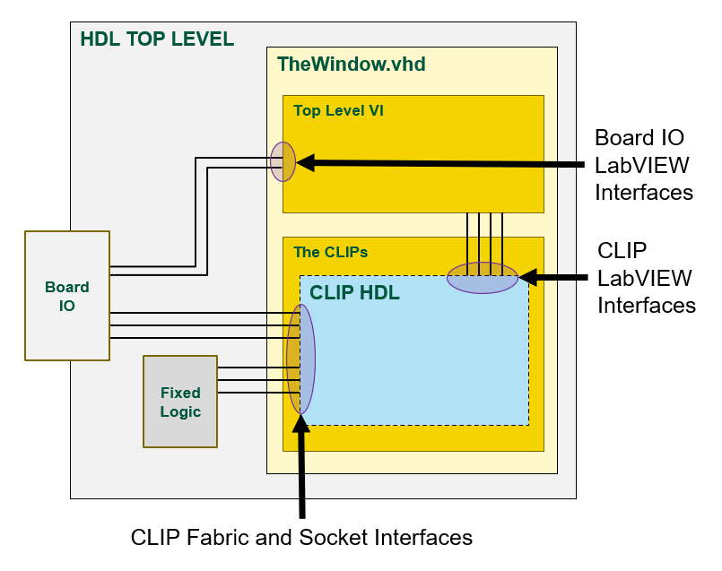

The CLIP LabVIEW interfaces are automatically connected to the Top Level VI during LabVIEW FPGA code generation.  The CLIP Fabric and Socket interfaces are exposed on the ports of the LabVIEW Window and are connected to IO and fixed logic in the top-level design.

To take advantage of the new HDL workflow tools, we want to move the Aurora CLIP HDL outside of the LabVIEW window and instantiate it directly in the PXIe-7903’s top-level HDL file.  The new workflow will use this customized top-level HDL file to create a custom LabVIEW FPGA target that has the Aurora interfaces built into it.

Moving the Aurora HDL outside of the LabVIEW window means that we need to reconnect the signals that go in and out of it.

Here is the new custom HDL target architecture:

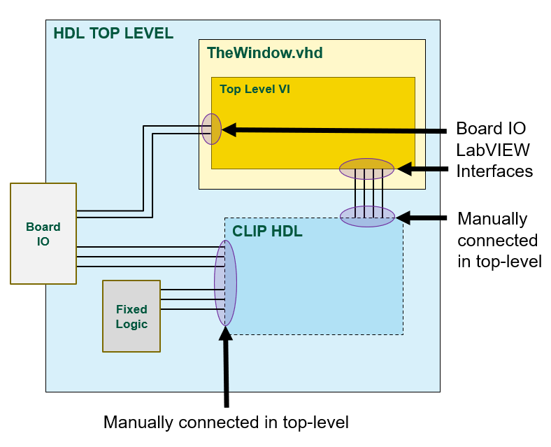

In this modified design, the old CLIP LabVIEW interface (defined in the CLIP XML) will become custom board IO LabVIEW interfaces (defined in the LVTargetBoardIO CSV).  This LVTargetBoardIO will show up on as IO on the custom LabVIEW FPGA target in the LabVIEW project.  This board IO will become new interfaces on the ports of the LabVIEW Window.  In the top-level HDL file, you will manually connect these LabVIEW interface ports from the CLIP HDL to the LabVIEW Window HDL.

The Fabric and Socket interfaces of the CLIP will be directly in the top-level HDL file and you will connect those up the same way they were previously connected to the LabVIEW Window.

# Customize the PXIe-7903 with Aurora

## Configure nihdlsettings.py for CLIP Migration

Open the target's settings file: `C:\dev\github\flexrio-custom\targets\pxie-7903aurora\nihdlsettings.py`

All settings are configured with `config.set_*()` / `config.add_*()` calls inside the `pre_all()` function.  Relative paths are resolved from the folder that contains `nihdlsettings.py`, and you should always use forward slashes (`/`).

By default the tool auto-discovers the latest installed LabVIEW (2023–2030).  If you need to point at a specific LabVIEW install, set it explicitly:

```python
config.set_labview_path("C:/Program Files/National Instruments/LabVIEW 2024")
```

Locate the Aurora CLIP on your computer:

```text
C:\dev\github\flexrio-custom\dependencies\githubdeps\ni.hw-flexrio.sasquatch_aurora64b66b_clip.25.5.0.11-ci-passed-main-f
```

Set the **inputs** of the CLIP migration to the file paths in the CLIP folder.  A `clip_deps` variable keeps the long path readable:

```python
clip_deps = "../../dependencies/githubdeps/ni.hw-flexrio.sasquatch_aurora64b66b_clip.25.5.0.11-ci-passed-main-f/aurora64b66b_framing_crcx4_28p0GHz/CLIP/aurora64b66b_framing_crcx4_28p0GHz/Source"

config.set_clip_input_xml(f"{clip_deps}/xml/PXIe7903_Aurora64b66b_Framing_Crcx4_28p0GHz.xml")
config.set_clip_top_hdl(f"{clip_deps}/vhdl/UserRTL_PXIe7903_Aurora64b66b_Framing_Crcx4_28p0GHz.vhd")
config.add_clip_constraints(f"{clip_deps}/xdc/PXIe7903_Aurora64b66b_Framing_Crcx4_28p0GHz.xdc")
config.add_clip_constraints(f"{clip_deps}/xdc/PXIe7903_microblaze_debug_place.xdc")
```

Set the CLIP entity path.  The CLIP's top-level entity will be placed directly in the top-level HDL file of the FPGA target, so this is just the name of the instance you give the CLIP's top-level entity:

```python
config.set_clip_entity_path("UserRTL_PXIe7903_Aurora64b66b_Framing_Crcx4_28p0GHz_inst")
```

Set the **outputs** of the CLIP migration:

```python
config.set_clip_output_csv("lvFpgaTarget/LVTargetBoardIO.csv")
config.set_clip_inst_example("objects/CLIPMigration/CLIPInstantiationExample.vhd")
config.set_clip_to_window_signal_definitions("objects/CLIPMigration/CLIPtoWindowSignalDefinitions.vhd")
config.set_clip_output_xdc_folder("objects/CLIPMigration/xdc")
```

The VHD and XDC files generated by the migrate-clip command go into the objects folder.  The contents of these files will be manually copied into source code in later steps.

The output CSV file will be directly treated as source code (that can get checked in to GitHub) so we put it in the lvFpgaTarget folder.  This will overwrite the default CSV file that you got from the GitHub repo.

We must also configure the LabVIEW FPGA target to consume the `LVTargetBoardIO.csv` generated by the CLIP migration tool:

```python
config.set_custom_io_csv("lvFpgaTarget/LVTargetBoardIO.csv")
config.set_include_custom_io_on_lv_window(True)
```

These target settings have no bearing on the execution of the migrate-clip command.  But we'll set them here because they will consume the output of the migrate-clip command.

## Run CLIP Migration

Run the migrate-clip command:

```text
nihdl migrate-clip
```

Review the output files:

```text
C:\dev\github\flexrio-custom\targets\pxie-7903aurora\objects\CLIPMigration
C:\dev\github\flexrio-custom\targets\pxie-7903aurora\lvFpgaTarget\LVTargetBoardIO.csv
```

## Modify Board IO CSV

Open LVTargetBoardIO.csv (preferably in Excel)

This file was generated from the CLIP’s XML definition file.  There are a number of changes we have to make so that the signals can be used as board IO.

LVName – No changes are needed for this column.  However, at this time the backslash character (“\”) is not supported in the names of LV FPGA board IO.  The script that generates the LabVIEW FPGA target plugin automatically replaces backslashes with periods (“.”).

RequiredClockDomain – When the CLIP HDL is instantiated by LabVIEW, it has clocks that are configured on the IO Socket in the LabVIEW FPGA project.  For the PXIe-7903 Aurora CLIP, all of these are connected to the 80 MHz clock.  When you instantiate the CLIP HDL in the top-level of the PXIe-7903, you will manually hook these signals to the 80 MHz clock.

Some signals driven between the LabVIEW FPGA VI diagram and the CLIP HDL are synchronous to this clock.  So in the CSV file, signals that required these clock domains should be configured to be required to be in the “80 MHz Clock” domain.

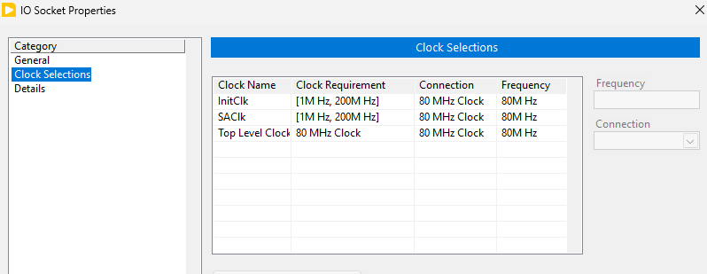

In the CSV, make these replacements:

| **Old** **RequiredClockDomain** | **New** **RequiredClockDomain** |
| --- | --- |
| InitClk | 80 MHz Clock |
| SAClk | 80 MHz Clock |
| Top Level Clock | 80 MHz Clock |

*NOTE:* *If you are using search and replace in Excel, be careful to ONLY do replacements in the* *RequiredClockDomain* *column*

The CLIP XML also defines a number of port-specific clocks that show up as clocks in the LabVIEW FPGA project.  Here is what it looked like in the LabVIEW Project with the old CLIP in the IO Socket of the PXIe-7903:

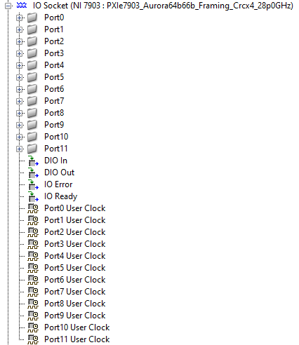

These IO Socket clocks become board clocks of the custom FPGA target in the new architecture.  To help maintain compatibility with LabVIEW FPGA VI code written using the original CLIP, these clocks are called “IO Socket.Port0 User Clock” in the new custom LabVIEW FPGA target.

In the CSV, make these replacements:

| **Old** **RequiredClockDomain** | **New** **RequiredClockDomain** |
| --- | --- |
| Port0 User Clock | IO Socket.Port0 User Clock |
| Port1 User Clock | IO Socket.Port1 User Clock |
| *… repeat for remaining ports …* | *… repeat for remaining ports …* |

*NOTE:* *If you are using search and replace in Excel, be careful to ONLY do replacements in the* *RequiredClockDomain* *column*

## Instantiate CLIP Code into Top-Level HDL

SasquatchTopTemplate.vhd is the top-level entity of the PXIe-7903:

C:\dev\github\flexrio-custom\targets\pxie-7903aurora\rtl-lvfpga\SasquatchTopTemplate.vhd

There are a number of changes to make so that the Aurora CLIP HDL can be instantiated within it.  It may also be helpful to diff your work against the already-customized PXIe-7903 found here that you cloned onto your computer:

```text
C:\dev\github\flexrio-custom\targets\pxie-7903aurora
```

### Uncomment MGT Port Lines

The PXIe-7903 supports designs using different MGT lines (or none at all).  To accommodate this, the LabVIEW FPGA code generation tools use macros in the top-level HDL file to enable/disable the needed MGT lines.  In the port of SasquatchTopTemplate.vhd, you will see the MGT port lines in-between these tokens:

```text
--@@BEGIN TOP_LEVEL_PORT
--    MgtPortRxLane0_p     : in    std_logic;
--    MgtPortRxLane1_p     : in    std_logic;
--    MgtPortRxLane2_p     : in    std_logic;
…
--@@END TOP_LEVEL_PORT
```

Since we are manually instantiating the Aurora MGT’s in the file, and our design uses all of the lines, we can uncomment all of the port lines.

### Generate TheWindow.vhd Stub

The LabVIEW FPGA IO interfaces that used to be socketed CLIP IO now become board IO to the LabVIEW FPGA window.  So we must insert these ports into both the component definition and component instantiation of TheWindow entity.

Open the generated TheWindow.vhd stub found here:

```text
C:\dev\github\flexrio-custom\targets\pxie-7903aurora\objects\rtl-lvfpga\lvgen\TheWindow.vhd
```

TheWindow.vhd stub is generated during the gen-vivado command.  The first time you ran it, we did not have custom board IO specified in the LVTargetBoardIO CSV file.  If you are looking at that file now (and haven’t run any other steps yet), you won’t see anything in the CUSTOM BOARD IO section of the port.

But since running the migrate-clip command, we now have all of the CLIP signals in the LVTargetBoardIO CSV file.  So if we re-run the gen-vivado command, all of that IO will be pulled into TheWindow.vhd port stub.

Since we’ve run gen-vivado before, we must use the --update argument

In the command prompt, run

```text
nihdl gen-vivado --update
```

Now you should see the signals from LVTargetBoardIO in TheWindow.vhd port.

Next we will update TheWindow.vhd instantiation in the top-level HDL file (SasquatchTopTemplate.vhd) so that it can use these new ports from LVTargetBoardIO.

### Add Custom Board IO to TheWindow Component Instantiation

Find the component definition of TheWindow in SasquatchTopTemplate.vhd.  Copy the CUSTOM BOARD IO section of the port map and paste it into the CUSTOM BOARD IO section of TheWindow component instantiation in SasqatchTopTemplate.vhd

```text
component TheWindow is
    port(
```

```text
-----------------------------------
-- CUSTOM BOARD IO
-----------------------------------
-- <-- *** INSERT CUSTOM BOARD PORT DEFINITIONS IO HERE *****
-----------------------------------
-- Communication interface ports
-----------------------------------
```

### Add Custom Board IO Signal Definitions

The custom board IO ports on TheWindow are connected to ports on the Aurora CLIP HDL entity with signals.  These signals must be defined in the top-level SasquatchTopTemplate.vhd file.

Open the generated CLIPtoWindowSignalDefintions.vhd found here:

```text
C:\dev\github\flexrio-custom\targets\pxie-7903aurora\objects\CLIPMigration\CLIPtoWindowSignalDefinitions.vhd
```

Copy all of the signal definitions into the signal definitions section of SasquatchTopTemplate.vhd (next-to / before / after the other signal definitions)

There are a few signals of the CLIP’s port that do not need to be defined as signals: TopLevelClk80, InitClk, SAClk.

These clocks will be manually connected to the 80 MHz clock on the CLIP instantiation so we can delete these signal definitions to avoid errors/warnings during synthesis

Delete these lines:

```text
signal TopLevelClk80 : std_logic; -- Top Level Clock To Clip (output)
signal InitClk : std_logic; -- InitClk (output)
signal SAClk : std_logic; -- SAClk (output)
```

### Add Custom Board IO Signals to TheWindow.vhd Instantiation

Now we must connect these signals to the component instantiation of TheWindow.vhd inside of SasquatchTopTemplate.vhd.

Open TheWindowInstantiationExample.vhd that was generated during gen-vivado:

```text
C:\dev\github\flexrio-custom\targets\pxie-7903aurora\objects\rtl-lvfpga\lvgen\TheWindowInstantiationExample.vhd
```

Copy all of the board IO port connections from the port map.  This may be difficult because this instantiation example does not contain comments.  You can use TheWindow.vhd stub file (that has comments) as a guide to where the ports begin and end.

Here are the first and last ports you are looking for.  Copy this section of the port connections:

```text
 xIoModuleReady => xIoModuleReady,
… MORE PORTS …
sGtwiz11DrpChAxiRReady => sGtwiz11DrpChAxiRReady,
```

Find TheWindow instantiation in SasquatchTopTemplate.vhd.

Paste the board IO port connections into TheWindow component instantiation:

```text
SasquatchWindow: TheWindow
   port map (
          <<== PASTE BOARD IO PORT CONNECTIONS HERE
     aBusReset                           => aBusReset
     bRegPortIn                          => bRegPortIn
     bRegPortOut                         => bLvWindowRegPortOut
     bRegPortTimeout                     => bLvWindowRegPortTimeout,
```

You might be wondering why we are copying just the newly-added board IO ports over to TheWindow instantiation and not all of them.  The script that generates TheWindowInstantiationExample.vhd simply maps all ports to signals with the same name.  This works fine for the board IO connections between TheWindow and the Aurora CLIP because those names match.  However, there are many other ports on TheWindow that go to differently-names signals and we do not want to break those.

### Disconnect the CLIP IO Socket Ports on TheWindow Instantiation

When the CLIP was instantiated by LabVIEW FPGA inside TheWindow, there were a number of signals connecting to it from the fixed-logic and ports on the top-level.  These signals passed through the ports on TheWindow to reach the CLIP.

Now that the CLIP HDL is moved outside of TheWindow, these ports are no longer needed on TheWindow.  Ideally we would remove them from TheWindow, but due to some dependencies within LabVIEW FPGA and the FlexRIO driver, we must leave the CLIP socket enabled on the LabVIEW FPGA target.  This will be simplified later when we can do a driver upgrade.  But for the purposes of this Tech Preview, we did not want to impose that.

Since these signals on TheWindow are no longer needed, they can be disconnected or driven to ‘0’.

On TheWindow instantiation in SasquatchTopTemplate.vhd, find the IO socket ports that will be between these tags:

```text
---------------------
-- BEGIN IO SOCKET PORTS
---------------------
<<<=== *** IO SOCKET PORTS ARE HERE ***
---------------------
-- END IO SOCKET PORTS
---------------------
```

Replace those port connections with this block of code that disconnects them:

```text
AxiClk => '0',
xDiagramAxiStreamFromClipTData => open,
xDiagramAxiStreamFromClipTLast => open,
xDiagramAxiStreamFromClipTReady => open,
xDiagramAxiStreamFromClipTValid => open,
xDiagramAxiStreamToClipTData => (others => '0'),
xDiagramAxiStreamToClipTLast => '0',
xDiagramAxiStreamToClipTReady => '0',
xDiagramAxiStreamToClipTValid => '0',
xHostAxiStreamFromClipTData => open,
xHostAxiStreamFromClipTLast => open,
xHostAxiStreamFromClipTReady => open,
xHostAxiStreamFromClipTValid => open,
xHostAxiStreamToClipTData => (others => '0'),
xHostAxiStreamToClipTLast => '0',
xHostAxiStreamToClipTReady => '0',
xHostAxiStreamToClipTValid => '0',
xClipAxi4LiteMasterARAddr => open,
xClipAxi4LiteMasterARProt => open,
xClipAxi4LiteMasterARReady => '0',
xClipAxi4LiteMasterARValid => open,
xClipAxi4LiteMasterAWAddr => open,
xClipAxi4LiteMasterAWProt => open,
xClipAxi4LiteMasterAWReady => '0',
xClipAxi4LiteMasterAWValid => open,
xClipAxi4LiteMasterBReady => open,
xClipAxi4LiteMasterBResp => (others => '0'),
xClipAxi4LiteMasterBValid => '0',
xClipAxi4LiteMasterRData => (others => '0'),
xClipAxi4LiteMasterRReady => open,
xClipAxi4LiteMasterRResp => (others => '0'),
xClipAxi4LiteMasterRValid => '0',
xClipAxi4LiteMasterWData => open,
xClipAxi4LiteMasterWReady => '0',
xClipAxi4LiteMasterWStrb => open,
xClipAxi4LiteMasterWValid => open,
xClipAxi4LiteInterrupt => '0',
stIoModuleSupportsFRAGLs => open,
MgtRefClk_p => (others => '0'),
MgtRefClk_n => (others => '0'),
MgtPortRx_p => (others => '0'),
MgtPortRx_n => (others => '0'),
MgtPortTx_p => open,
MgtPortTx_n => open,
aDio => open,
aLmkI2cSda => open,
aLmkI2cScl => open,
aLmk1Pdn_n => open,
aLmk2Pdn_n => open,
aLmk1Gpio0 => open,
aLmk2Gpio0 => open,
aLmk1Status0 => '0',
aLmk1Status1 => '0',
aLmk2Status0 => '0',
aLmk2Status1 => '0',
aIPassVccPowerFault_n => '0',
aIPassPrsnt_n => (others => '0'),
aIPassIntr_n => (others => '0'),
aIPassSCL => open,
aIPassSDA => open,
aPortExpReset_n => open,
aPortExpIntr_n => '0',
aPortExpSda => open,
aPortExpScl => open,
```

### Instantiate the Aurora CLIP

Open the CLIPInstantiationExample.vhd:

```text
C:\dev\github\flexrio-custom\targets\pxie-7903aurora\objects\CLIPMigration\CLIPInstantiationExample.vhd
```

Copy the CLIP instantiation code into SasquatchTopTemplate.vhd.  To make it easy to compare against the results in the flexrio-custom GitHub repo, we recommend putting it directly after TheWindow instantiation.

Make sure that the `set_clip_entity_path` setting in the nihdlsettings.py file matches the instance name you used when putting the CLIP code into the top-level VHDL file.

```python
config.set_clip_entity_path("UserRTL_PXIe7903_Aurora64b66b_Framing_Crcx4_28p0GHz_inst")
```

### Modify Aurora CLIP Signals

The CLIP instantiation example simply connects all of the ports to signals with the same name.  This works for most ports but some need to be connected to signals of different names.

AResetSl should be connected to the aDiagramReset signal that comes out of TheWindow.  This lets us reset the Aurora logic when the LabVIEW FPGA VI goes into reset.

```text
aResetSl => aDiagramReset,
```

The PllClk80 signal from the Timing Engine is connected to a signal called BusClk.  This is the 80 MHz clock that should drive things in the Aurora logic.

TopLevelClk80 should be connected to BusClk signal:

```text
TopLevelClk80 => BusClk,
```

AxiClk should be connected to the BusClk signal

```text
AxiClk => BusClk,
```

InitClk should be connected to the BusClk signal

```text
InitClk => BusClk,
```

SAClk should be connected to the BusClk signal

```text
SAClk => BusClk
```

The CLIP AXI bus connections to the Fixed Logic need different port names and the CLIP AXI interrupt is not used (driven to ‘0’);

```text
xClipAxi4LiteMasterARAddr => bdClipAxi4LiteARAddr,
xClipAxi4LiteMasterARProt => bdClipAxi4LiteARProt,
xClipAxi4LiteMasterARReady => bdClipAxi4LiteARReady,
xClipAxi4LiteMasterARValid => bdClipAxi4LiteARValid,
xClipAxi4LiteMasterAWAddr => bdClipAxi4LiteAWAddr,
xClipAxi4LiteMasterAWProt => bdClipAxi4LiteAWProt,
xClipAxi4LiteMasterAWReady => bdClipAxi4LiteAWReady,
xClipAxi4LiteMasterAWValid => bdClipAxi4LiteAWValid,
xClipAxi4LiteMasterBReady => bdClipAxi4LiteBReady,
xClipAxi4LiteMasterBResp => bdClipAxi4LiteBResp,
xClipAxi4LiteMasterBValid => bdClipAxi4LiteBValid,
xClipAxi4LiteMasterRData => bdClipAxi4LiteRData,
xClipAxi4LiteMasterRReady => bdClipAxi4LiteRReady,
xClipAxi4LiteMasterRResp => bdClipAxi4LiteRResp,
xClipAxi4LiteMasterRValid => bdClipAxi4LiteRValid,
xClipAxi4LiteMasterWData => bdClipAxi4LiteWData,
xClipAxi4LiteMasterWReady => bdClipAxi4LiteWReady,
xClipAxi4LiteMasterWStrb => bdClipAxi4LiteWStrb,
xClipAxi4LiteMasterWValid => bdClipAxi4LiteWValid,
xClipAxi4LiteInterrupt => '0',
```

The std_logic_vector ports for the MGT lines need to be split out into individual std_logic signals  Delete this:

```text
MgtPortRx_p => MgtPortRx_p,
MgtPortRx_n => MgtPortRx_n,
MgtPortTx_p => MgtPortTx_p,
MgtPortTx_n => MgtPortTx_n,
```

Replace with this:

```text
MgtPortRx_n(0) => MgtPortRxLane0_n,
MgtPortRx_n(1) => MgtPortRxLane1_n,
…
MgtPortRx_p(0) => MgtPortRxLane0_p,
MgtPortRx_p(1) => MgtPortRxLane1_p,
…
MgtPortTx_n(0) => MgtPortTxLane0_n,
MgtPortTx_n(1) => MgtPortTxLane1_n,
…
MgtPortTx_p(0) => MgtPortTxLane0_p,
MgtPortTx_p(1) => MgtPortTxLane1_p,
```

It may be easiest for you to copy these signal connections from the completed example in the flexrio-custom repo.

### (Optional) Compare Against FlexRIO-Custom example

In later steps, you will use Vivado to synthesize the design.  You may encounter syntax or port connection errors in this stage.  This will replicate a real-world scenario of doing HDL development.  Using Vivado to debug errors is a key part of the workflow.

If you run into problems, you can compare the changes you made against SasquatchTopTemplate.vhd in the flexrio-custom repo.  Or you can do that comparison now if you want to avoid potential errors in later steps.

## Copy CLIP Constraints into Board Constraints

The custom target provides a dedicated constraints file for inserting your own constraints.  This file is referenced by the `set_custom_constraints` setter in nihdlsettings.py.  Open it here:

```text
C:\dev\github\flexrio-custom\targets\pxie-7903aurora\xdc\custom_constraints.xdc
```

Because we are manually inserting the CLIP HDL into the FPGA’s top-level entity, we must also manually insert the CLIP constraints into this file so that Vivado applies them.

Open the CLIP constraints files here:

```text
C:\dev\github\flexrio-custom\targets\pxie-7903aurora\objects\CLIPMigration\xdc
```

Copy the contents of those files into custom_constraints.xdc.

## Add the CLIP HDL to the Vivado Project Sources

In the PXIe-7903 target folder, create a file called vivadoprojectclipsources.txt

In a text editor, add this to the file:

```text
../../dependencies/githubdeps/ni.hw-flexrio.sasquatch_aurora64b66b_clip.25.5.0.11-ci-passed-main-f/aurora64b66b_framing_crcx4_28p0GHz/CLIP/aurora64b66b_framing_crcx4_28p0GHz/Source/vhdl/AXI4_Lite_to_DRP.vhd
../../dependencies/githubdeps/ni.hw-flexrio.sasquatch_aurora64b66b_clip.25.5.0.11-ci-passed-main-f/aurora64b66b_framing_crcx4_28p0GHz/CLIP/aurora64b66b_framing_crcx4_28p0GHz/Source/vhdl/AxiLiteToMgtDrp.vhd
../../dependencies/githubdeps/ni.hw-flexrio.sasquatch_aurora64b66b_clip.25.5.0.11-ci-passed-main-f/aurora64b66b_framing_crcx4_28p0GHz/CLIP/aurora64b66b_framing_crcx4_28p0GHz/Source/vhdl/MgtTest_DRP_bridge.vhd
../../dependencies/githubdeps/ni.hw-flexrio.sasquatch_aurora64b66b_clip.25.5.0.11-ci-passed-main-f/aurora64b66b_framing_crcx4_28p0GHz/CLIP/aurora64b66b_framing_crcx4_28p0GHz/Source/vhdl/PkgAXI4Lite_GTYE4_Control.vhd
../../dependencies/githubdeps/ni.hw-flexrio.sasquatch_aurora64b66b_clip.25.5.0.11-ci-passed-main-f/aurora64b66b_framing_crcx4_28p0GHz/CLIP/aurora64b66b_framing_crcx4_28p0GHz/Source/vhdl/PXIe659XR_AXI4_Lite_Address_Map.vhd
../../dependencies/githubdeps/ni.hw-flexrio.sasquatch_aurora64b66b_clip.25.5.0.11-ci-passed-main-f/aurora64b66b_framing_crcx4_28p0GHz/CLIP/aurora64b66b_framing_crcx4_28p0GHz/Source/vhdl/UserRTL_PXIe7903_Aurora64b66b_Framing_Crcx4_28p0GHz.vhd
../../dependencies/githubdeps/ni.hw-flexrio.sasquatch_aurora64b66b_clip.25.5.0.11-ci-passed-main-f/aurora64b66b_framing_crcx4_28p0GHz/CLIP/aurora64b66b_framing_crcx4_28p0GHz/Target/aurora64b66b_framing_crcx4_28p0GHz.dcp
../../dependencies/githubdeps/ni.hw-flexrio.sasquatch_aurora64b66b_clip.25.5.0.11-ci-passed-main-f/aurora64b66b_framing_crcx4_28p0GHz/CLIP/aurora64b66b_framing_crcx4_28p0GHz/Target/AXI4Lite_GTYE4_Control_Regs4.edf
../../dependencies/githubdeps/ni.hw-flexrio.sasquatch_aurora64b66b_clip.25.5.0.11-ci-passed-main-f/aurora64b66b_framing_crcx4_28p0GHz/CLIP/aurora64b66b_framing_crcx4_28p0GHz/Target/AxiFramingRegx4.edf
../../dependencies/githubdeps/ni.hw-flexrio.sasquatch_aurora64b66b_clip.25.5.0.11-ci-passed-main-f/aurora64b66b_framing_crcx4_28p0GHz/CLIP/aurora64b66b_framing_crcx4_28p0GHz/Target/AxiLiteClockConverterWrapper.edf
../../dependencies/githubdeps/ni.hw-flexrio.sasquatch_aurora64b66b_clip.25.5.0.11-ci-passed-main-f/aurora64b66b_framing_crcx4_28p0GHz/CLIP/aurora64b66b_framing_crcx4_28p0GHz/Target/SasquatchClipFixedLogic.dcp
```

These are the HDL source files for the CLIP code that you are inserting into the top-level PXIe-7903 VHDL file.

In the nihdlsettings.py file, register this new sources file alongside the HDL file lists already configured:

```python
config.add_hdl_file_list("vivadoprojectclipsources.txt")
```

The next time you run gen-vivado, these CLIP source code files will be automatically pulled into the Vivado project.

## Synthesize the Customized FPGA Target

Make sure that Vivado is closed.

Run gen-vivado with the --update argument to add these new files to the Vivado project

```text
nihdl gen-vivado --update
```

Launch Vivado:

```text
nihdl launch-vivado
```

In Vivado, click **Synthesize**

This will synthesize the design to ensure that all of the ports are properly connected.  You may encounter errors.  The easiest way to debug them is to open the runme.log file in the synthesis run folder:

```text
C:\dev\github\flexrio-custom\targets\pxie-7903aurora\VivadoProject\MySasquatchProj.runs\synth_1\runme.log
```

Once you have the design synthesizing you can run Implementation to debug any errors in that stage.  Note that the generated bitfile will not be fully functional because you have not yet imported a netlist for the LabVIEW window.  The LabVIEW FPGA VI is necessary to control the MGTs and communicate with the host PC.

## Create Custom LabVIEW FPGA Target

### Modify nihdlsettings.py for the Custom Target

Specify the custom target name:

```python
config.set_lv_target_name("PXIe-7903Aurora")
```

Specify the LabVIEW FPGA Target GUID.  You can generate a new GUID by running `nihdl gen-guid`, or from this link: [https://www.guidgenerator.com/](https://www.guidgenerator.com/)


We provide a working LabVIEW FPGA project in the example in the flexrio-custom GitHub repo.  You may use the same GUID as the target we made for that project so that the LabVIEW FPGA projects are compatible.

```python
config.set_lv_target_guid("8943868e-fc0c-4e48-a2e9-1ebce7779d5c")
```

### Generate and Install the Custom Target

From the command prompt run:

```text
nihdl gen-target
```

This will generate a custom LabVIEW FPGA target plugin into the objects folder.

Before installing the custom FPGA target, close all LabVIEW instances.

From the command prompt run:

```text
nihdl install-target
```

This will install the custom LabVIEW FPGA target plugin into the NI LVAddons folder inside Program Files.  It may ask for administrator permission to do this.  In the future, we may support installation to folders that are outside of Program Files.

## Create the LabVIEW FPGA Custom Target Aurora Example

### Create a LabVIEW FPGA project for the new custom target

Launch LabVIEW and create a blank project

Add the custom LabVIEW FPGA target to the project under My Computer:

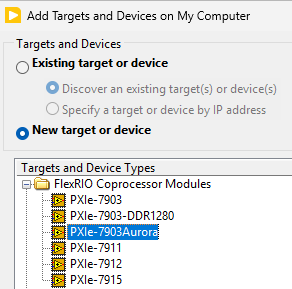

Add all of the custom board IO to the FPGA target:

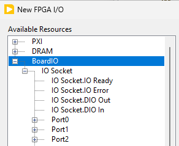

Create a 200 MHz clock derived from the 80 MHz clock:

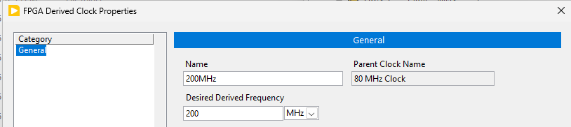

Save and close the project.

### Create the Aurora Shipping Example Project for the PXIe-7903

Open the Example Finder (Help >> Find Examples)

Open the Getting Started FlexRIO Integrated IO example:

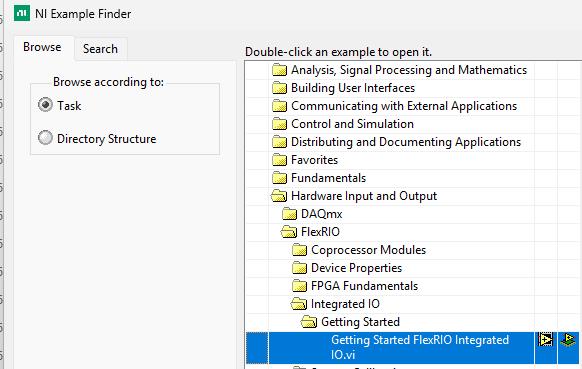

Select the PXIE-7903 Aurora example and click OK

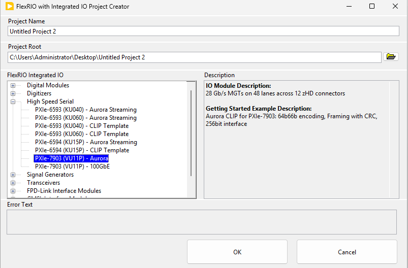

Pay close attention to the Project Root where the project will be created.  In my experience, this project creation tool may hang during creation or auto-close (crash) when it is done.  Clicking on the window while it is running may cause it to go into the “Not Responding” state.  Give it about 10 minutes and then go check in the file explorer to see if the project was created.

### Copy objects to the custom PXIe-7903Aurora project

Open both the generated project for the PXIe-7903 and your custom PXIe-7903Aurora projects side-by-side.

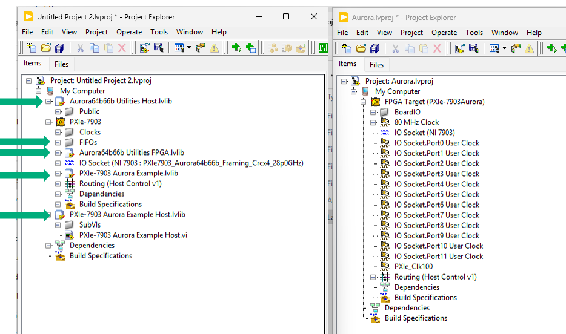

Move the following items by click-and-dragging them from one project to the other:

Under the My Computer target:

- Aurora64b66b Utilities Host.lvlib
- PXIe-7903 Aurora Example Host.lvlib

Under the FPGA target:

- FIFOs
- Aurora64b66b Utilities FPA.lvlib
- PXIe-7903 Aurora Example.lvlib
Close and don’t save the original PXIe-7903 project.

Save the PXIe-7903Aurora project.

### Add the Dummy CLIP

Due to some dependencies within LabVIEW FPGA and the FlexRIO driver, we need to put something in the CLIP IO Socket of the custom PXIe-7903 device that we are using.  This is something we will resolve in a future release.  For now, we have created a Dummy CLIP that you can use to work around this issue.  You can find this in the flexrio-custom GitHub repo that is cloned onto your computer: `C:\dev\github\flexrio-custom\targets\pxie-7903aurora\DummyCLIP`

#### Add the Dummy CLIP to the FPGA Target

Right click on the FPGA Target and select Properties

Go to the Component-Level IP tab and click the + button

Select the Dummy CLIP you got from the flexrio-custom repo:

```text
C:\dev\github\flexrio-custom\targets\pxie-7903aurora\DummyCLIP\DummyCLIP.xml
```

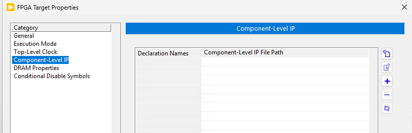

#### Add the Dummy CLIP to the IO Socket

Right click on the IO Socket and select Properties

You should see DummyCLIP already in the list

Click OK

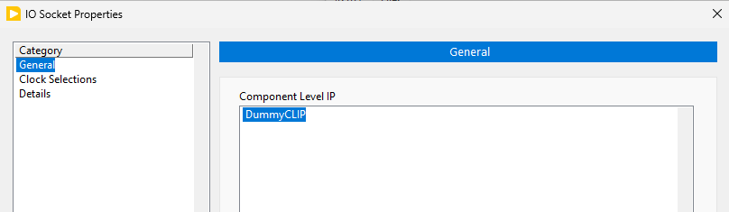

## Modify the FPGA VI IO Constants

CLIP IO supports backslash characters and hierarchy that is not supported by the LV FPGA target board IO.  To work around this, the gen-target tool automatically replaces characters from from the LVTargetBoardIO CSV file with periods.  You will need to re-select all of the FPGA IO in the VI to use these new IO names.

On the block diagram for **Top (FPGA).vi** that is in PXIe-7903 Aurora Example.lvlib (under the FPGA target in the project), replace the IO Ready and IO Error signals:

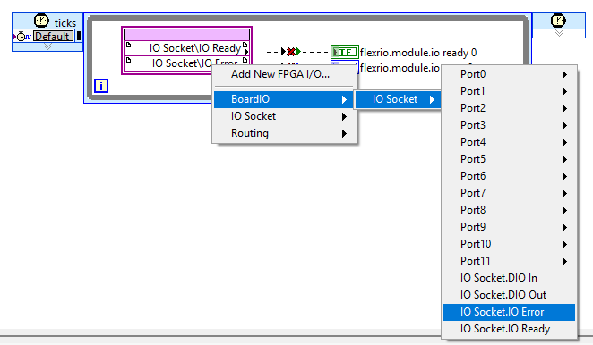

Open the Port0 Constructor VI:

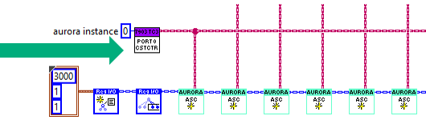

Double click on the CLIP IO constants cluster to expand it:

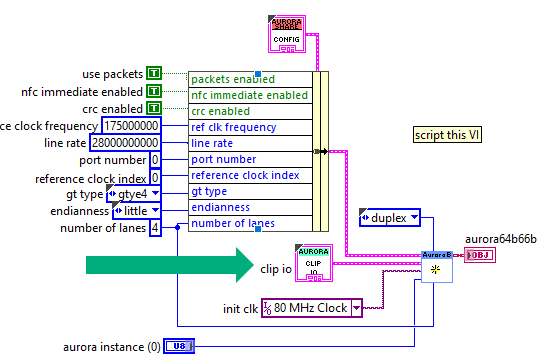

In this constant, all of the backslashes need to be replaced with periods:

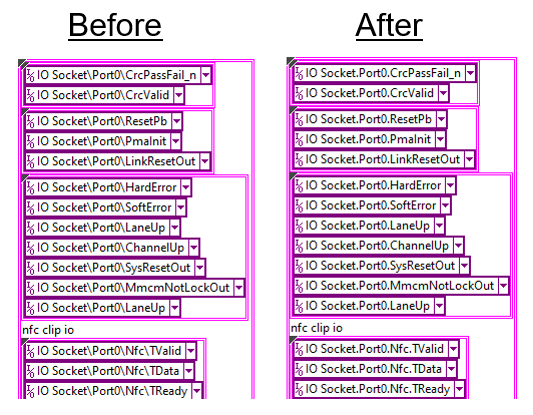

We recognize that this is a tedious and error-prone process.  We encourage you to copy these constants from our completed example in the flexrio-custom repo: `C:\dev\github\flexrio-custom\targets\pxie-7903aurora\docs\Examples`

Note: If you want to save time, you can only update ports 0 and 1.  And then in the FPGA top-level VI, delete the constructor subVIs and loops for ports 2-11.  You can find this in the “2-port” version of the top VI in the example linked on GitHub.

## Export LabVIEW FPGA Window Netlist

We want to get a netlist for the top-level VI so we can incorporate it into the HDL and Vivado workflow.  This is achieved by doing a Vivado Project Export to get the HDL for the top-level VI.  And then we run a gen-window command to extract a netlist for TheWindow from the Vivado Project Export files.

### Vivado Project Export

In the LabVIEW project, under the FPGA, right-click Build Specifications >> Project Export for Vivado.

Select the Source Files tab on the left and set the Top (FPGA).vi to be the Top-Level VI of the Vivado Project Export

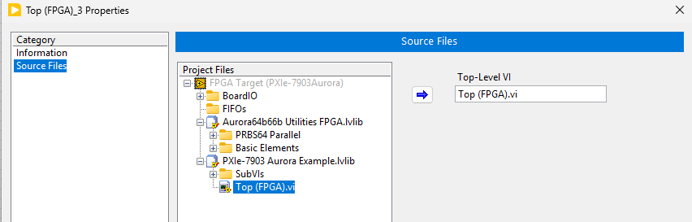

Click OK and then right-click on the new Vivado Project Export in the project and select Build.

### Get the Netlist for The Window

Find the Vivado project XPR file that was created by the Vivado Project Export.   It should be in a folder like this:

```text
C:\Users\Administrator\Desktop\GuideExample\ProjectExportForVivado\VPE_1\VivadoProject\Top_FPGA.xpr
```

Right-click on that file and select Copy as Path

In the nihdlsettings.py file, set the path to the XPR file.  Also specify the output folder where you want TheWindow netlist to be placed.

```python
# Inputs
config.set_lv_window_vivado_project_export_xpr(r"C:\Users\Administrator\Desktop\GuideExample\ProjectExportForVivado\VPE_2-port\VivadoProject\Top_FPGA_2.xpr")

# Outputs
config.set_lv_window_netlist_output_folder("objects/TheLvWindowNetlist")
```

**NOTE:** Vivado has trouble when the project’s folder path is over 80 characters.  The script checks for this and may throw a long-path error.  If you are using the example that is in the flexrio-custom repo documents folder, the default location of the Vivado Project Export folder will likely create a long path.  You can simply move the Vivado Project Export folder to a shorter path before setting it in nihdlsettings.py.

At the command prompt, run the gen-window command:

```text
nihdl gen-window
```

This process may take a few hours.

## Build Custom FPGA Bitfile in Vivado

Point the Vivado project at the generated netlist by setting the LabVIEW Window netlist folder to match the output folder you used in the previous step:

```python
config.set_lv_window_netlist_folder("objects/TheLvWindowNetlist")
```

Rerun the gen-vivado command (with the `--update` argument) to regenerate the files for the Vivado project.  When the LabVIEW Window netlist folder is set, the files in that folder automatically replace the default/stub files in the Vivado project.

Make sure you have closed any open Vivado projects before running the gen-vivado command.

```text
nihdl gen-vivado --update
```

Launch Vivado:

```text
nihdl launch-vivado
```

In Vivado, click **Generate Bitfile**

This will run the synthesis and implementation processes resulting in a bitfile.  The gen-lvbitx command is automatically run as a post implementation step.  That command will pack the Xilinx bitstream file into the .lvbitx file used by the NI-RIO driver.

You can find the generated .lvbitx file here:

```text
C:\dev\github\flexrio-custom\targets\pxie-7903aurora\objects\bitfiles
```

## Run the Host example

If you have a PXIe-7903, you can run the host example to test out the bitfile generated for your custom FPGA target.

Open PXIe-7903 Aurora Example Host.vi (inside PXie-7903 Aurora Example Host.lvlib)

Select the device and bitfile.

The rest of the VI’s defaults should work.  If you are using the “2-port” version of the example, set the first aurora instance to 0 and the second aurora instance to 1.

Run the VI.

The VI does a wrap-back between the MGTs in the FPGA.  To test it, you need to connect the PXIe-7903 front-panel connectors in a wrap-back fashion.
