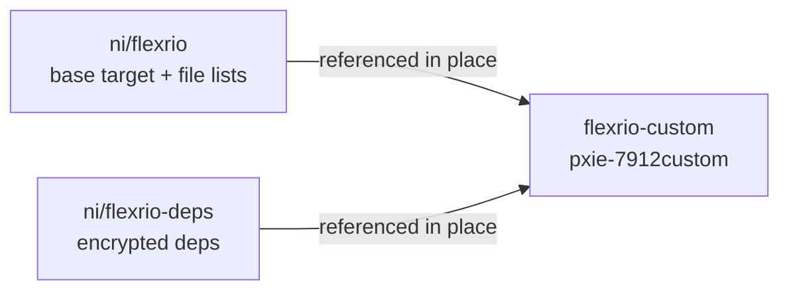

# Creating a FlexRIO Baseboard Custom Target

**Audience:** developers standing up a new `<device>custom` baseboard example in `flexrio-custom`
(for example `pxie-7912custom`) on top of a released NI base target.

> This guide is the **customer-facing half** of the workflow: it takes an already-released base
> target and turns it into the basic `<device>custom` example. Producing the base targets themselves
> is a separate NI-internal step.

---

## 1. What you're building

NI publishes each supported FlexRIO baseboard as a **base target** in
[`ni/flexrio`](https://github.com/ni/flexrio) (source + pre-computed dependency/file lists) plus its
encrypted dependencies in [`ni/flexrio-deps`](https://github.com/ni/flexrio-deps). A **custom target**
in this repo references that base target *in place* and adds a user-editable top level, window
wrappers, and a testbench — the starting point a customer copies for their own design.



**Guiding principle** ([Dependencies and File Management](DependenciesAndFileManagement.md)): a custom
target **copies only the top-level HDL file** and **references everything else in place** from the
released base target, so it inherits base-target updates without duplicating sources.

The `pxie-7912custom` example (`targets/pxie-7912custom/`) contains every file below. Section
[§2](#2-file-by-file-reference) documents each one; the inline notes here are the one-line summary.

```
pxie-7912custom/
  .gitignore                                 # ignore build outputs; keep the githubvisible tag
  nisetup.bat                                # one-line shim -> repo-root nisetup.bat
  nihdlsettings.py                           # single source of truth for the whole target (Step 5)
  vivadoprojectsources.txt                   # ordered synthesis source list for this target
  modelsimprojectsources.txt                 # curated sim source list for tb_UserHdl
  rtl-lvfpga/
    MacallanTop.vhd                          # top level: COPIED from base target, then modified
    UserHdl.vhd                              # example user design (registers/loopbacks/FIFOs/DIO)
    PkgUserHdl.vhd                           # UserHdl component + register/FIFO map
    TheLvWindowFlatWrapper.vhd.mako          # window flat wrapper (ports match base TheWindow.vhd.mako)
    PkgTheLvWindowFlatWrapper.vhd.mako       # component declaration for the flat wrapper
    testbenches/
      tb_UserHdl.vhd                         # thin tb wrapper -> shared UserHdlTestCore
  lvFpgaTarget/
    LVTargetBoardIO.csv                      # custom-I/O CSV (header-only when board I/O is off)
  xdc/
    custom_constraints.xdc                   # target-specific constraints (may be an empty stub)
  blankLvWindowNetlist/                      # placeholder Verilog netlist + LV pkgs so gen-vivado runs pre-VI
    TheLvWindowFlatWrapper.v
    PkgCommIntConfiguration.vhd
    PkgDmaPortCommIfcRegs.vhd
    PkgDmaPortDmaFifos.vhd
    PkgLvFpgaConst.vhd
    TheWindowConstraints.xdc
    CodeGenerationResults.lvtxt
  docs/
    HostInterfaces.md                        # host register/FIFO API reference (regen from PkgUserHdl)
    Examples/LV2023/...                      # LabVIEW host + running-VI examples
  objects/ VivadoProject*/ ModelSimProject*/ # build artifacts (generated, gitignored)
```

A few files are **shared** across all custom targets and are *referenced in place* rather than copied
per target (edit once, every target inherits):

```
targets/common/
  rtl-lvfpga/PkgNiHdlSettings.vhd.mako           # template for the generated settings package
  rtl-lvfpga/testbenches/PkgUserHdlTest.vhd      # shared test stimulus/params
  rtl-lvfpga/testbenches/UserHdlTestCore.vhd     # board-agnostic test core tb_UserHdl drives
  TCL/*.tcl(.mako)                               # Vivado project/compile/window-netlist scripts
```

---

## 2. File-by-file reference

A custom target is small, and almost every file is either copied from the base target, copied from the
nearest sibling custom target, or generated. This section lists **every** file so a new target can be
produced with nothing left implicit. "Nearest sibling" = the closest existing `<device>custom` target
of the same board family (for the 79xx boards, another Macallan target).

**Origin key:**

| Origin | Meaning |
|--------|---------|
| **Author** | Write/edit by hand for this target. |
| **Copy (base)** | Copy from `deps/flexrio/targets/<device>/`, then modify. |
| **Copy (sibling)** | Copy from the nearest existing custom target, then adjust device-specific values. |
| **Generated** | Produced by `nihdl` into `objects/` at build time — **never** hand-edited, **not** checked in. |
| **Reference** | Not stored in the target; pulled in by path from the base target, shared `../common/`, or `deps/`. |

| File | Origin | Purpose / how to make it |
|------|--------|--------------------------|
| `.gitignore` | Copy (sibling) | Ignores `objects/`, `VivadoProject*/`, `ModelSimProject*/`, `*.log`. Keep the `# githubvisible=true` tag line — it marks the file for the release. |
| `nisetup.bat` | Copy (sibling) | One-line shim that calls the repo-root `nisetup.bat`. Identical across targets. |
| `nihdlsettings.py` | Author (from sibling) | The single source of truth — see [Step 5](#7-step-5--write-nihdlsettingspy). Copy a sibling's and change device values (`base_deps`, FPGA part, `lv_target_name`, a fresh GUID, register offset, FIFO count). |
| `vivadoprojectsources.txt` | Author | Ordered synthesis source list — see [below](#vivadoprojectsourcestxt--synthesis-source-list). |
| `modelsimprojectsources.txt` | Author | Curated simulation source list for `tb_UserHdl` — see [below](#modelsimprojectsourcestxt--simulation-source-list). |
| `rtl-lvfpga/<Board>Top.vhd` | Copy (base) + modify | The top level — see [Step 3](#5-step-3--copy-and-modify-the-top-level-hdl). The only base source you copy. |
| `rtl-lvfpga/UserHdl.vhd`, `PkgUserHdl.vhd` | Copy (sibling) + adjust | The example user design (registers, loopbacks, DMA FIFOs, DIO) and its register/FIFO map — see [Step 3](#5-step-3--copy-and-modify-the-top-level-hdl). **Board-I/O ports are _not_ inherited from the sibling: re-derive the complete `% if include_board_io:` set from *this* board's base `TheWindow.vhd.mako` — routing is vertical, never copied from another board.** |
| `rtl-lvfpga/TheLvWindowFlatWrapper.vhd.mako`, `PkgTheLvWindowFlatWrapper.vhd.mako` | Copy (sibling) + match ports | The window flat wrapper and its component declaration — see [Step 4](#6-step-4--author-the-window-wrappers-mako). Ports must match the base `TheWindow.vhd.mako`. |
| `rtl-lvfpga/testbenches/tb_UserHdl.vhd` | Copy (sibling) + adjust | Thin testbench wrapper — see [below](#rtl-lvfpgatestbenchestb_userhdlvhd--testbench-wrapper). |
| `lvFpgaTarget/LVTargetBoardIO.csv` | Author | Custom-I/O CSV — see [below](#lvfpgatargetlvtargetboardiocsv--custom-io-csv). Header-only (no signal rows) when board I/O is routed to `UserHdl` instead of the window. |
| `xdc/custom_constraints.xdc` | Author | Target-specific Vivado constraints. Often an empty stub; add pin/timing constraints unique to your design. |
| `blankLvWindowNetlist/…` | Copy (sibling) + regenerate | Placeholder window netlist + LV packages — see [below](#blanklvwindownetlist--placeholder-window-netlist). |
| `docs/HostInterfaces.md` | Author (regen) | Host register/FIFO API reference generated from `PkgUserHdl.vhd`; regenerate when the register/FIFO map changes. |
| `docs/Examples/LV2023/…` | Copy (sibling) + adjust | LabVIEW host + running-VI examples the customer runs against the target. |
| `objects/`, `VivadoProject*/`, `ModelSimProject*/`, `__pycache__/` | Generated | Build artifacts. Never authored, never committed (gitignored). |

**Referenced, not copied** — shared across all custom targets under `targets/common/` (edit once, all
targets inherit): `rtl-lvfpga/PkgNiHdlSettings.vhd.mako` (template for the generated settings
package), `rtl-lvfpga/testbenches/PkgUserHdlTest.vhd` (shared test stimulus/params),
`rtl-lvfpga/testbenches/UserHdlTestCore.vhd` (board-agnostic test core `tb_UserHdl` instantiates), and
`TCL/*.tcl(.mako)` (Vivado project / compile / window-netlist scripts used by every target).

### `vivadoprojectsources.txt` — synthesis source list

An **ordered** list of the HDL this target contributes to synthesis, on top of the base-target and
shared deps pulled in via `add_hdl_file_list(...)` in `nihdlsettings.py`. Order matters (packages
before their users). It contains three blocks:

1. The generated window + wrappers + settings package from `objects/GeneratedHDL/`: `TheWindow.vhd`,
   `TheLvWindowFlatWrapper.vhd`, `PkgTheLvWindowFlatWrapper.vhd`, `PkgNiHdlSettings.vhd`.
2. This target's top and user design: `rtl-lvfpga/<Board>Top.vhd`, `rtl-lvfpga/UserHdl.vhd`,
   `rtl-lvfpga/PkgUserHdl.vhd`.
3. The shared host-interface HDL it instantiates (register + DMA-FIFO cores from `deps/hdl-shared`).

Copy a sibling's list and swap the top-file name; keep the generated-file block and the shared
register/FIFO block as-is.

### `modelsimprojectsources.txt` — simulation source list

A **deliberately curated subset** for simulating `UserHdl` in isolation with `tb_UserHdl`. It
**excludes** everything that cannot compile in a plain `vcom` flow — the top level, the LV window, and
all netlist-based IP (instruction FIFO, DRAM, timing engine, fixed logic, PCIe DMA). It **includes**:

- The shared infrastructure packages `UserHdl` depends on (comm-interface config, DMA config, and the
  shared register/FIFO cores).
- The **sim-only protocol checkers** (`RegPortProtocolChecker`, `NiSharedFifo*Checker`): the shared
  cores instantiate these under `synthesis translate_off`, and `vcom` still compiles that region, so
  the checker entities must be present or elaboration fails.
- The generated `objects/GeneratedHDL/PkgNiHdlSettings.vhd`.
- `PkgUserHdl.vhd` / `UserHdl.vhd` (the block under test).
- The shared `common/rtl-lvfpga/testbenches/PkgUserHdlTest.vhd` + `UserHdlTestCore.vhd`, then this
  target's `rtl-lvfpga/testbenches/tb_UserHdl.vhd`.

Copy a sibling's list; the only per-target lines are the top-of-file comment and the `tb_UserHdl`
path. The example file is heavily commented — keep those comments, they justify each inclusion.

### `rtl-lvfpga/testbenches/tb_UserHdl.vhd` — testbench wrapper

A thin wrapper that instantiates `UserHdl` directly, ties off its board-I/O ports, and drives it from
the shared `UserHdlTestCore` (so the stimulus lives once in `../common`). Copy the sibling's, match
the board-I/O tie-offs to this target's `UserHdl` interface, and run it with
`nihdl gen-modelsim --overwrite` / `nihdl sim-modelsim` (look for `ALL TESTS PASSED`).

### `lvFpgaTarget/LVTargetBoardIO.csv` — custom-I/O CSV

The single source that drives any custom I/O placed **into the LabVIEW FPGA window** (board I/O
signals and clocks). On these HDL-customized targets board I/O is routed into `UserHdl` instead of the
window ([Step 3](#5-step-3--copy-and-modify-the-top-level-hdl) /
`set_include_board_io_on_lv_window(False)`), so the CSV is typically **just the header row** (no
signal rows). Keep it present and header-correct; add rows only if you deliberately expose custom
I/O/clocks to the VI. See
[LVTargetBoardIO.csv Reference](https://github.com/ni/labview-fpga-hdl-tools/blob/main/docs/LVTargetCustomIO-Reference.md).

### `blankLvWindowNetlist/` — placeholder window netlist

Lets `nihdl gen-vivado` build **before** a real window netlist has been exported from a LabVIEW FPGA
VI — see [Step 6](#8-step-6--provide-a-placeholder-window-netlist). It holds a stub
`TheLvWindowFlatWrapper.v` plus the LV packages the netlist references (`PkgCommIntConfiguration.vhd`,
`PkgDmaPortCommIfcRegs.vhd`, `PkgDmaPortDmaFifos.vhd`, `PkgLvFpgaConst.vhd`), `TheWindowConstraints.xdc`,
and `CodeGenerationResults.lvtxt`. Copy a sibling's folder; once you export a real VI, regenerate with
`nihdl gen-window` and repoint `set_lv_window_netlist_folder(...)` at `objects/TheLvWindowNetlist`.

---

## 3. Step 1 — Install the dependencies

From the repo root, `nihdl install-deps` clones the four dependency repos into `deps/` per
`dependencies.toml` (`ni/flexrio`, `ni/flexrio-deps`, `ni/hdl-shared`, `ni/flexrio-clips`). Keep the
NI-versioned deps on the same quarterly version. The base target lands at
`deps/flexrio/targets/pxie-7912/`.

## 4. Step 2 — Scaffold the target folder

The fastest path is to **copy the nearest existing custom example** (e.g. `pxie-7903custom` or a
sibling Macallan custom target) and rename it, then fix up the device-specific values. Create the
folder `targets/pxie-7912custom/` and populate the files listed above.

## 5. Step 3 — Copy and modify the top-level HDL

Copy the base target's top (`deps/flexrio/targets/pxie-7912/rtl-lvfpga/MacallanTop.vhd`) into
`rtl-lvfpga/MacallanTop.vhd`. This is the *only* base source you copy. Inside it you make two changes:

- **Instantiate the window through the flat wrapper.** The top level brings the window in as a VHDL
  **component instantiation** of `TheLvWindowFlatWrapper` (not a direct entity). The component is
  declared in `PkgTheLvWindowFlatWrapper` (Step 4), so `use work.PkgTheLvWindowFlatWrapper.all;` and
  instantiate `TheLvWindowFlatWrapper` where the base target instantiated `TheWindow`.
- **Route the board I/O into `UserHdl`, not the window.** Because this is an HDL-customized target,
  the board's physical I/O is consumed by *your* HDL. The authoritative list of what to route is the
  set of ports gated by `% if include_board_io:` in *this board's* base-target `TheWindow.vhd.mako`:
  every one of those ports is wired into your `UserHdl` stub instead of into the window/flat wrapper.
  This set is **board-specific** — read it from this board's own base window, never copy it from
  another board (see Step 3's recipe step 9 and [Digital IO](DigitalIO.md)).

> **Board-I/O routing is _vertical_, never _horizontal_.** For one target there is exactly **one**
> board-I/O list, and it flows straight down that target's *own* stack:
>
> **this board's base `TheWindow.vhd.mako` `% if include_board_io:` block(s)  →  its
> `TheLvWindowFlatWrapper` (the same ports, just rendered off)  →  its `UserHdl`.**
>
> All three are the **identical set**, and it comes **solely from _this_ board's own base window**.
> **Never** derive, copy, or infer a target's board-I/O routing from another module — not from a
> sibling's `UserHdl`, top, wrapper, or window. Sibling files are a typing shortcut for the
> **board-agnostic** body only; the instant you touch board I/O, discard the sibling's version and
> re-read *this* board's `TheWindow.vhd.mako`. Grafting another board's board-I/O ports (e.g. a
> baseboard-I2C / QSFP interface that this board doesn't have) is the #1 cause of `… is not declared`
> elaboration failures.

**Author the `UserHdl` stub (`UserHdl.vhd` / `PkgUserHdl.vhd`).** `UserHdl` is the block where the
customer's design lives; ship it as a small, working example rather than an empty shell. You may copy
a sibling custom target's `UserHdl.vhd` / `PkgUserHdl.vhd` as a starting point **for the board-agnostic
parts only** (registers, loopbacks, DMA FIFOs). Its board-I/O port set is *that sibling's*, not
yours — **delete every board-I/O port and re-derive the complete set from this board's own
`% if include_board_io:` block** (see the vertical-routing rule above). A good starter stub
demonstrates the pieces a customer will actually reuse:

- **Registers** — a few host-writable/readable control-and-status registers on the HDL register
  interface (sized by `set_max_hdl_reg_offset`).
- **Register loopbacks** — write-a-value / read-it-back registers so the host can prove the register
  path end to end.
- **Example DMA FIFOs** — the user HDL DMA FIFOs reserved by `set_num_hdl_fifos`, wired as a simple
  loopback (host→FPGA→host) so the DMA path is exercised.
- **Example DIO** — drive/read the board's DIO through whichever interface this target routes into
  `UserHdl`; match the target's style in [Digital IO](DigitalIO.md).

### The base → custom top-level modification recipe

> **The top and the flat wrapper are a coupled pair — generate them together.** The top instantiates
> `TheLvWindowFlatWrapper`, and that wrapper's port list must match the top's connections *and* the
> board's own window ports exactly. Because the window boundary is **board-specific** (notably the
> memory interface — Macallan/PXIe `dHmbDram*`/`dLlbDram*` vs Garrison/PCIe `du0Dram*`/`du1Dram*`), you
> **cannot** reuse another board's flat wrapper. Whenever you produce or modify a board's custom top,
> regenerate that board's `TheLvWindowFlatWrapper.vhd.mako` / `PkgTheLvWindowFlatWrapper.vhd.mako`
> (Step 4) from the *same* board's base window, and vice-versa. Doing one without the other will not
> elaborate.

The custom tops were produced by **hand-modifying the base target's top**. The changes below are the
complete recipe (verified by diffing the `pxie-7912custom` and `pxie-7981custom` tops against their
base tops). Apply them in order to a fresh copy of the base top. The steps are **board-agnostic unless
marked "board-specific"** — the board-specific pieces are wired from whatever ports the *base top for
that board* already exposes (e.g. the memory interface differs: Macallan/PXIe uses `dHmbDram*` /
`dLlbDram*`, Garrison/PCIe uses `du0Dram*` / `du1Dram*`), so always take those port names from the
board's own base top, never from another board.

1. **Add `use` clauses** (near the other `use work.*` lines):
   ```vhdl
   -- User HDL
   use work.PkgNiSharedFifo.all;
   use work.PkgUserHdl.all;
   use work.PkgNiHdlSettings.all;
   use work.PkgDmaPortDmaFifosFlatTypes.all;
   use work.PkgDmaPortCommIfcMasterPortFlatTypes.all;
   -- The Window Component Instantiation
   use work.PkgTheLvWindowFlatWrapper.all;
   ```

2. **Promote the window-interface signals to explicit declarations.** In the base top these are
   auto-declared inside the `--vhook_sigstart … --vhook_sigend` block; the flat wrapper needs them
   declared by hand, so **move** these out of the `vhook_sigstart` block to an explicit block above it:
   `bRegPortIn`, `bRegPortOut`, `bLvWindowRegPortOut`, `bIrqToInterface`,
   `dInputStreamInterfaceToFifo` / `dInputStreamInterfaceFromFifo`,
   `dOutputStreamInterfaceToFifo` / `dOutputStreamInterfaceFromFifo`, and the eight
   `dNiFpgaMaster*Array` signals. (If you leave them in `vhook_sigstart` you get duplicate-declaration
   errors.)

3. **Add the flattened-type signals** (the `*Flat std_logic_vector` mirrors the wrapper consumes):
   `bRegPortInFlat`, `bRegPortOutFlat`, `dInputStreamInterfaceToFifoFlat` /
   `dInputStreamInterfaceFromFifoFlat`, `dOutputStreamInterfaceToFifoFlat` /
   `dOutputStreamInterfaceFromFifoFlat`, `bIrqToInterfaceFlat`, and the eight
   `dNiFpgaMaster*ArrayFlat` signals — each sized `Larger(kNumberOf…,1)*SizeOf(k…Zero)-1 downto 0`
   (copy the exact widths from an existing custom top).

4. **Add the UserHdl-side signals and constants:**
   - `signal bRegPortOutUserHdl : RegPortOut_t;`
   - the four `dWin*StreamInterface*Fifo` arrays (window-side stream signals for FIFO interception).
   - `constant kHmbDmaChannelNum : natural := kUserHdlDmaStartIndex - kNumHdlFifos;` **(board-specific:
     only where the board has an HMB / `Dram2DP` channel — see step 8.)**
   - `constant kAuxDioDefaultVoltageConst : natural := 3300;` (the DIO is now driven from HDL, not the
     VI, so pin the AUX-DIO voltage here instead of using `kAuxDioDefaultVoltage`).

5. **Retarget the DMA config on the host interface.** In the `HostInterfacex`/`G*UsHostInterface…`
   generic map, replace the plain array/force values so the user-HDL FIFO channels are merged in:
   ```vhdl
   kDmaFifoConfArrayGeneric => MergeDmaFifoConf(kDmaFifoConfArray, kUserHdlDmaFifoConf, kUserHdlDmaStartIndex),
   kForceChannelEnable      => GetForceChannelEnable(kUserHdlDmaFifoConf, kUserHdlDmaStartIndex),
   ```

6. **(board-specific) Replace LabVIEW-generated `PkgLvFpgaConst` constants with HDL-defined values.**
   A custom target's `PkgLvFpgaConst.vhd` comes from the blank window netlist (no CLIP configured), so
   the constants LabVIEW normally generates from the CLIP are **not defined** there. Any base-top code
   that references them fails elaboration with *"… is not declared"*. Replace each such reference with
   an HDL constant or literal you define in the architecture:
   - `kAuxDioDefaultVoltage` → the `kAuxDioDefaultVoltageConst : natural := 3300;` from step 4, used in
     the `FixedLogicWrapperx` generic map (`kAuxDioDefaultVoltageGeneric => kAuxDioDefaultVoltageConst`).
   - `kExpectedTbId` → an HDL constant set to the TbID of the IO frontend this target uses.
   - `kEnableFamClockSync` / `kFamClockSrcSel` (used to derive the board-IO ref-clock enables
     `kEnableIoRefClk10/100`) → define those enables as literals instead, e.g. to enable the 100 MHz IO
     reference clock:
     ```vhdl
     constant kEnableIoRefClk10  : std_logic := '0';
     constant kEnableIoRefClk100 : std_logic := '1';
     ```
   Which constants appear is board-specific — grep the base top for names sourced from `PkgLvFpgaConst`
   and replace every one. This is a *runtime/elaboration* swap, not a parse-time one, so it only shows
   up when you actually elaborate/synthesize.

7. **Merge UserHdl into the register-port output.** Where the top OR-combines register-port results,
   add the UserHdl term:
   ```vhdl
   bRegPortOut.Data      <= bLvWindowRegPortOut.Data      or … or bRegPortOutUserHdl.Data;
   bRegPortOut.DataValid <= bLvWindowRegPortOut.DataValid or … or bRegPortOutUserHdl.DataValid;
   bRegPortOut.Ready     <= bLvWindowRegPortOut.Ready     and … and bRegPortOutUserHdl.Ready;
   ```

8. **(Board-specific) Retarget the HMB / `Dram2DP` DMA channel.** On boards that have an HMB
   (`Dram2DP`) block, change its hard-coded `kDmaChannelNum` literal to
   `to_unsigned(kHmbDmaChannelNum, 7)` so it moves below the user-HDL FIFO channels. Boards without an
   HMB (`du*Dram`-only, e.g. Garrison) have no `Dram2DP` block, so skip this step and the
   `kHmbDmaChannelNum` constant.

9. **Instantiate `UserHdl`.** Add `UserHdl_inst : entity work.UserHdl` with:
   - clocks/resets (`BusClk`, `DmaClk`, `aBusReset`, `aDiagramReset`), `bRegPortIn`, and
     `bRegPortOut => bRegPortOutUserHdl`;
   - the writer channel at `kUserHdlDmaStartIndex - 1` and the reader channel at `kUserHdlDmaStartIndex`
     (all four `d*StreamInterface*Fifo(idx)` per channel);
   - **(board-specific) route this board's board I/O into `UserHdl`.** Because the window has board I/O
     disabled (`set_include_board_io_on_lv_window(False)`), **every port inside `% if include_board_io:`
     in *this board's* base-target `TheWindow.vhd.mako` is connected here, into `UserHdl`, instead of
     the window** — wired to the same signals the base top's `TheWindow` instantiation drove. That
     `include_board_io` block is the authoritative list of what to route. The set is **board-specific**
     (e.g. the eight `aLvAuxDioN*` DIO IO-Node ports on all these boards, plus a `DioMgt*` Aux-MGT
     interface on some — 7982/7985 have it, 7981 does not). **Read it from this board's own
     `TheWindow.vhd.mako` / base top; never copy it from another board**, and make sure `UserHdl`'s
     port list (`PkgUserHdl`) exposes exactly that set.

10. **Add the stream-interface routing generate.** Insert the `StreamRouting` `for … generate` that
    passes normal channels straight through to the window (`dWin*` ⇄ `d*`) and drives the user-HDL
    channels' window-side `ToFifo` inputs to their `k…Zero` defaults (the user-HDL channels are owned
    by `UserHdl`). Copy this block verbatim from an existing custom top.

11. **Swap `TheWindow` for `TheLvWindowFlatWrapper`.** This is the largest edit:
    - Change the instance from `TheLvWindow: entity work.TheWindow (behavioral)` to
      `TheLvWindowWrapper: TheLvWindowFlatWrapper` (and update the `--vhook_e` / `--vhook_i`
      directives; add `--vhook_a` renames that map `bRegPort(In|Out)`→`bRegPort$1Flat`,
      `dNiFpgaMaster*`→`*ArrayFlat`, `bIrqToInterface`→`bIrqToInterfaceFlat`,
      `d(Input|Output)StreamInterface(To|From)Fifo`→`…Flat`, `bRegPortTimeout`→
      `to_stdlogic(bLvWindowRegPortTimeout)`).
    - Wire the register/stream/IRQ/master ports to the **flattened** signals.
    - **Remove the board-I/O ports** from the wrapper instantiation — this is exactly the
      `% if include_board_io:` set from this board's `TheWindow.vhd.mako`, which is now routed to
      `UserHdl` (step 9) instead of the window. Nothing gated by `include_board_io` should appear on
      the `TheLvWindowFlatWrapper` instantiation.
    - **(board-specific)** Keep the memory-interface ports the board actually has (Macallan: `dHmbDram*`
      + `dLlbDram*`; Garrison: `du0Dram*` + `du1Dram*`) and the trigger-routing / clock ports, wired
      exactly as the base top's `TheWindow` had them.

12. **Add the flatten / unflatten glue** after the wrapper instantiation:
    - inputs → flat: `bRegPortInFlat <= to_StdLogicVector(bRegPortIn);`,
      `d*StreamInterfaceToFifoFlat <= FlattenStreamInterface(dWin*StreamInterfaceToFifo);`, and the
      `gen_master_inputs_flat` generate that flattens the master-port `*ToMaster` arrays.
    - flat → records: `bLvWindowRegPortOut <= BuildRegPortOut(bRegPortOutFlat);`,
      `dWin*StreamInterfaceFromFifo <= UnflattenStreamInterface(d*StreamInterfaceFromFifoFlat);`,
      `bIrqToInterface <= BuildIrqToInterfaceArray(bIrqToInterfaceFlat);`, and the
      `gen_master_outputs_unflatten` generate for the master-port `*FromMaster` arrays.

> **Tip for a new board in the same family:** run a 3-way merge to apply this recipe automatically —
> `git merge-file <copy-of-board-base-top> <sibling-base-top> <sibling-custom-top>`. The board-agnostic
> steps merge cleanly; the conflicts it reports are the board-specific regions, which you resolve
> against the new board's base top. **Watch out:** a merge only flags regions that differ *textually*
> between the two base tops — differences that happen to align (e.g. a reg-port signal named differently
> but in the same place) can merge silently wrong, so still walk the reconciliation list below.

**Board-specific reconciliations (these differ per board and are the usual source of elaboration
errors). Always resolve each against _this board's own base top / `TheWindow.vhd.mako`_, never another
board's:**

| Area | What differs | Recipe step |
|------|--------------|-------------|
| Memory interface | `du0Dram*`/`du1Dram*` (e.g. Garrison/PCIe) vs `dHmbDram*`/`dLlbDram*` (e.g. Macallan/PXIe) | 11 + the flat wrapper (Step 4) |
| HMB / `Dram2DP` | present (HMB boards) vs absent (`du*Dram`-only boards have no `Dram2DP`; the step-7 reg-port merge then drops the `bRegPortOutDram2DP` term) | 7, 8 |
| Host-interface entity | e.g. `G3UsHostInterface` + `kHmbInUse => false` (+ hides `dNiHmb*`) vs `G3UsHostInterfaceIsoPort` + `kHmbInUse => true` | 5 |
| Reg-port topology | the host interface must drive the **muxed** `bRegPortIn`/`bRegPortOut`, not the raw `bLvWindowRegPort*` — verify the expanded port map, a merge won't flag it | 5, 7 |
| Clock-source select | some boards instantiate `IoRefClkSelect`; others drive `stEnableIoRefClk10/100` statically (no `IoRefClkSelect`) | 6 |
| `FixedLogicWrapper` generics | different generic/port set per board (TbID / DIO-voltage generics vs `stEnableIoRefClk*` ports) | 6 |
| LabVIEW-generated constants | `kAuxDioDefaultVoltage`, `kExpectedTbId`, `kEnableFamClockSync`, `kFamClockSrcSel` — **not** in a custom target's `PkgLvFpgaConst`; replace with HDL constants/literals | 6 |
| Board-I/O set | the `% if include_board_io:` ports routed to `UserHdl` — e.g. `DioMgt*` Aux-MGT present on some boards, absent on others | 9 |

> **If you generate these files programmatically, write them as BOM-free UTF-8.** A UTF-8 byte-order
> mark makes Vivado fail with *"syntax error near �"* at line 1. (PowerShell's `Out-File` /
> `Set-Content -Encoding utf8` prepend a BOM — use a BOM-free writer instead.)

## 6. Step 4 — Author the window wrappers (Mako)

> **Coupled with the top (Step 3).** The flat wrapper and the top level are generated **together** —
> the wrapper's ports must match both the top's `TheLvWindowFlatWrapper` instantiation and this
> board's own window ports. Never copy another board's wrapper unchanged: the window boundary is
> board-specific (e.g. the memory interface — `du0Dram*`/`du1Dram*` on Garrison/PCIe vs
> `dHmbDram*`/`dLlbDram*` on Macallan/PXIe). Derive this board's wrapper from this board's base window.

Create `rtl-lvfpga/TheLvWindowFlatWrapper.vhd.mako` and `rtl-lvfpga/PkgTheLvWindowFlatWrapper.vhd.mako`.
The wrapper's job is to **flatten and unflatten the record ports** on the base `TheWindow.vhd`: the
window is pulled into the Vivado flow as a **Verilog netlist**, and Verilog has no equivalent of VHDL
`record` types, so the wrapper flattens the record ports down to `std_logic_vector` going into the
window and unflattens them coming back out. `PkgTheLvWindowFlatWrapper` declares the component the top
level instantiates (Step 3). For the full rationale — and why the window is a component/netlist at all
— see
[The Window Netlist and Constraints Processing](https://github.com/ni/labview-fpga-hdl-tools/blob/main/docs/WindowNetlistAndConstraints.md)
and [Generated VHDL](https://github.com/ni/labview-fpga-hdl-tools/blob/main/docs/GeneratedVHDL.md).

**The wrapper is a DIRECT TRANSLATION of *this board's* `TheWindow.vhd.mako` — do not copy the port
list from a sibling.** Only the flatten/unflatten *architecture body* (the `Build*` / `Flatten*` /
`Unflatten*` calls and the `gen_master_*` generates) is board-agnostic boilerplate you can reuse. The
**entire port list** — entity, component declaration, and internal `TheWindow` port map — is generated
**directly from the base target's own `TheWindow.vhd.mako`**, port for port, in the same order:

- **Record-type ports** (`bRegPortIn` / `bRegPortOut`, the `dInput/dOutputStreamInterface*` streams,
  `bIrqToInterface`, the eight `dNiFpgaMaster*` master ports) become flattened `std_logic_vector`s in
  the wrapper — that is the wrapper's whole reason to exist.
- **Every other port** — clocks, trigger routing, the memory interface (`du*Dram*` / `dHmbDram*` /
  `dLlbDram*`), the `% if include_board_io:` blocks, and the target-method / property ports — is passed
  through **verbatim**, with the *same name, direction, type, and `% if` guards* as the base window.

Copying a sibling's wrapper and then "fixing up" the differences is exactly how the wrong board I/O
(e.g. another board's Aux-DIO instead of this board's MGT / JESD204 / PLL frontend) ends up in the
wrapper. Generate the port list from *this* window instead.

**Every port must match the base `TheWindow.vhd.mako` exactly.** A mismatch on any *non-gated* port
(clocks, the memory interface, trigger routing, …) is a hard elaboration failure. A mismatch **inside**
`% if include_board_io:` is more dangerous: on a custom target it is **silent** — the build and sim
never see it (see the ⚠️ warning at the end of this step). Render the base `TheWindow.vhd.mako` with
your target's flags and diff its port list against
your wrapper in **all three** places a port name appears: the wrapper **entity**, the **component
declaration** in `PkgTheLvWindowFlatWrapper`, and the **internal `TheWindow` instantiation's port-map
formals**. A stray formal in the internal port map fails the same way (`formal <name> is not declared`)
even when the entity and component agree, so verify the port map separately. Compare port-name sets both
**with and without** `include_board_io` so the board-I/O blocks stay port-compatible too (see below).

> **A top-level port tied `open` is *not* a window port — don't plumb it into the wrapper.** Some
> signals appear on the base *top* entity but are intentionally left unconnected there (e.g. an
> `--vhook_h aDramReady open` directive with `aDramReady : out std_logic;` on the top). These belong to
> the **top**, not to `TheWindow`, so they must **not** be added to the flat wrapper's entity, component
> declaration, or internal `TheWindow` port map. Adding one produces `formal <name> is not declared`
> plus a cascade of `<other> has no actual or default value` as named association breaks. When in doubt,
> the wrapper's port set is defined solely by the base `TheWindow.vhd.mako` — never by the top's entity.

If you do start from a sibling to save typing the flatten/unflatten body, treat **every port as
suspect** until you have re-derived it from this board's `TheWindow.vhd.mako`. The sections that differ
most between boards are the memory interface and its clocks (e.g. `dHmbDram*`/`dLlbDram*` +
`dHmbDmaClkSocket`/`dLlbDmaClkSocket` vs `du0Dram*`/`du1Dram*` + `DramClkLvFpga` / `Dram0/1ClkSocket` /
`Dram0/1ClkUser`), the `% if include_board_io:` blocks (see below), and any board-specific pins (e.g.
`aPxieDstar*`). Whatever you change must be applied identically in all three places these ports appear —
the wrapper **entity**, its internal `TheWindow` instantiation, and the **component declaration** in
`PkgTheLvWindowFlatWrapper` — or the component won't bind.

**Board I/O is off on a custom target.** `nihdlsettings.py` sets
`config.set_include_board_io_on_lv_window(False)`, which renders both `TheWindow.vhd.mako` and your
flat wrapper with `include_board_io = False` — the ports guarded by `% if include_board_io:` are
**omitted**. `include_board_io` exists to route all board I/O *into the LabVIEW FPGA window* so it can
be used from CLIP and the VI diagram. On an HDL-customized target you instead consume that I/O in the
top HDL and route it into `UserHdl` (see [Digital IO](DigitalIO.md)), so you leave it off.

Even though it is rendered off, the wrapper's `% if include_board_io:` block(s) must still be a
**verbatim, direct translation of this board's `TheWindow.vhd.mako` `% if include_board_io:` block(s)**
— the *same ports, directions, types, number of blocks, and positions*. A board may split its board I/O
into more than one `% if include_board_io:` block around the memory interface (e.g. a CLIP / MGT / PLL
block **before** the DRAM interface and a GT-DRP block **after** it) — reproduce that structure exactly.
This is the board's frontend, and it is **completely different** from board to board (one board's
`aLvAuxDio*` Aux-DIO vs another's `MgtPort*` / `dvJesd204SysRef` / `aPll*` / `ext_ch_gt_drp*`
MGT-JESD204 frontend), so it must come from *this* window — never inherited from the sibling you copied
the body from. That same board-I/O set, routed to `UserHdl`, is what the top consumes (Step 3, step 9):
the two are the identical list.

> **⚠️ A board-I/O mismatch here is SILENT — a green build does NOT prove parity.** This is the single
> most important thing to check by hand, and it is exactly how real targets have shipped with drifted
> board-I/O wrappers (extra QSFP ports on one board, a missing Aux-MGT socket on another). Because
> `set_include_board_io_on_lv_window(False)` strips every `% if include_board_io:` port out of *both*
> the base `TheWindow` **and** your flat wrapper *before* anything compiles, Vivado and ModelSim never
> see the two board-I/O port lists side by side. A flat wrapper whose board-I/O block has **extra**,
> **missing**, or **wrong-width** ports relative to this board's window still passes `gen-vivado`,
> `gen-target`, and `sim-modelsim` **cleanly** — the defect only becomes a hard error if the target is
> ever built with `include_board_io = True`. (This is the opposite of the *non-gated* ports — the
> memory interface, DRAM clocks, `aPxieDstar*`, or an `open` top-level port plumbed in by mistake —
> which are always rendered and so fail loudly with `formal <name> is not declared`. Board-I/O drift
> gives you no such signal.)
>
> So do **not** treat a passing build as proof. After any board-I/O edit, **manually diff** the
> `% if include_board_io:` port set across the four views that must be identical:
>
> 1. this board's base `TheWindow.vhd.mako`;
> 2. `TheLvWindowFlatWrapper.vhd.mako` — both the **entity** *and* the internal `TheWindow` **port map**;
> 3. `PkgTheLvWindowFlatWrapper.vhd.mako` — the **component declaration**; and
> 4. `UserHdl.vhd` / `PkgUserHdl.vhd` — which declare the same set and are the one place it is actually
>    exercised (in isolation, via `tb_UserHdl`).
>
> Render the base window with `include_board_io=True` so the ports are present to compare — diffing
> with it *off* only confirms the *rest* of the boundary matches, not the board I/O itself.

## 7. Step 5 — Write `nihdlsettings.py`

`nihdlsettings.py` is the single source of truth. It references the base target with a `base_deps`
prefix and wires up file lists, generated VHDL, constraints, the custom LabVIEW FPGA target identity,
and the HDL-to-host interface sizing. The key blocks (7912 example):

```python
base_deps = "../../deps/flexrio/targets/pxie-7912"

# HDL sources: base-target deps (encrypted) + THIS target's sources + shared FIFO deps
config.add_hdl_file_list(f"{base_deps}/vivadoprojectdeps.txt")
config.add_hdl_file_list("vivadoprojectsources.txt")
config.add_hdl_file_list("../../deps/flexrio-deps/hdl_shared_deps_list/hdlsharedvivadoprojectdeps.txt")

# Generated VHDL (single-sourced): the base window + this target's wrappers + PkgNiHdlSettings
config.add_generated_vhdl_template(f"{base_deps}/rtl-lvfpga/lvgen/TheWindow.vhd.mako")
config.add_generated_vhdl_template("rtl-lvfpga/TheLvWindowFlatWrapper.vhd.mako")
config.add_generated_vhdl_template("rtl-lvfpga/PkgTheLvWindowFlatWrapper.vhd.mako")
config.add_generated_vhdl_template("../common/rtl-lvfpga/PkgNiHdlSettings.vhd.mako")
config.set_generated_vhdl_output_folder("objects/GeneratedHDL")

# Custom LabVIEW FPGA target identity (unique name + GUID -> the base Resource.xml.mako custom_target branch)
config.set_lv_target_name("PXIe-7912Custom")
config.set_lv_target_guid("<run: nihdl gen-guid>")
config.add_lv_target_xml_template(f"{base_deps}/lvFpgaTarget/Resource.xml.mako")
config.add_lv_target_xml_template(f"{base_deps}/lvFpgaTarget/Macallan7912.xml.mako")

# Exclude lists: what LabVIEW FPGA provides itself (base target + shared FIFO)
config.add_lv_target_exclude_files(f"{base_deps}/lvtargetexcludefiles.txt")
config.add_lv_target_exclude_files("../../deps/flexrio-deps/hdl_shared_deps_list/hdlsharedlvtargetexcludefiles.txt")

# HDL-to-host sizing -> feeds min_lv_reg_offset and num_reserved_dma_stream_channel_ids in the base makos
config.set_max_hdl_reg_offset(1024)   # HDL register ceiling; min_lv_reg_offset = 1024 + 4
config.set_num_hdl_fifos(2)           # user HDL DMA FIFOs
```

**How the pieces connect to the base target:**
- The base target's `Resource.xml.mako` / device `.xml.mako` and `TheWindow.vhd.mako` are exactly what
  `add_lv_target_xml_template(...)` / `add_generated_vhdl_template(...)` render here with
  `custom_target = True` — that is what injects your unique `lv_target_name` and `lv_target_guid`.
- `set_max_hdl_reg_offset(n)` produces `${min_lv_reg_offset} = n + 4`, consumed by the base device XML
  (a custom target reserves the bottom of the shared register space for its user-HDL registers/FIFOs,
  so LabVIEW FPGA's window base shifts up).
- `set_num_hdl_fifos(...)` feeds `${num_reserved_dma_stream_channel_ids}` and the generated
  `PkgNiHdlSettings.vhd`, so the XML, the HDL, and the plugin can never disagree about how many DMA
  channels are reserved.

See [nihdlsettings-single-source](https://github.com/ni/labview-fpga-hdl-tools/blob/main/docs/GeneratedVHDL.md)
for the register-map and DMA-channel single-sourcing details.

## 8. Step 6 — Provide a placeholder window netlist

Populate `blankLvWindowNetlist/` (a `TheLvWindowFlatWrapper.v` plus the LV packages) and point
`set_lv_window_netlist_folder("blankLvWindowNetlist")`. This lets `nihdl gen-vivado` build before you
have exported a real netlist from a LabVIEW FPGA VI. Later you regenerate it with `nihdl gen-window`
and repoint the setting at `objects/TheLvWindowNetlist`.

## 9. Step 7 — Validate

Run the customer flows from the target folder:

- **Vivado compile flow:** `nihdl gen-vivado` → `nihdl launch-vivado` → Generate Bitstream.
- **LabVIEW FPGA compile flow:** `nihdl gen-target` → `nihdl install-target`, then drive the bitfile
  from a VI / the NI-RIO API.
- **Simulation:** `nihdl gen-modelsim --overwrite` → `nihdl sim-modelsim` (look for
  `ALL TESTS PASSED`). `sim-modelsim` returns nonzero on any testbench fatal/error, so it is safe to
  gate CI on.

The repo's own regression runner (`tests/manual/run_tests.py`) exercises these across all example
targets — add your new target to the sweep.

---

## 10. Checklist

- [ ] `nihdl install-deps` (base target lands under `deps/flexrio/targets/<device>`).
- [ ] Scaffold `targets/<device>custom/` (copy nearest sibling).
- [ ] Copy + modify the top-level HDL: instantiate `TheLvWindowFlatWrapper` as a component (from `PkgTheLvWindowFlatWrapper`); route board I/O into `UserHdl.vhd` / `PkgUserHdl.vhd`.
- [ ] Author the `UserHdl` stub (copy nearest sibling **for the board-agnostic parts only**) with example registers, register loopbacks, DMA FIFOs, and DIO — then **re-derive the board-I/O port set from _this_ board's `% if include_board_io:` block** (never keep the sibling's board I/O; routing is vertical within one target).
- [ ] Author `TheLvWindowFlatWrapper.vhd.mako` + `Pkg…` with **identical ports** to the base `TheWindow.vhd.mako` (board I/O off — `set_include_board_io_on_lv_window(False)`). **Manually diff the `% if include_board_io:` port set** (base window ↔ flat wrapper entity + internal `TheWindow` port map ↔ `Pkg` component decl ↔ `UserHdl`), rendered with `include_board_io=True` — a board-I/O mismatch is **silent**; the build and sim will **not** catch it.
- [ ] Write `nihdlsettings.py` (unique `lv_target_name` + fresh `nihdl gen-guid`; file lists; generated VHDL; excludes; `max_hdl_reg_offset` / `num_hdl_fifos`).
- [ ] Provide `blankLvWindowNetlist/` and the custom I/O CSV / constraints.
- [ ] Add a `tb_UserHdl.vhd` testbench; register the target in the test sweep.
- [ ] Validate: `gen-vivado` / `launch-vivado`; `gen-target` / `install-target`; `gen-modelsim` / `sim-modelsim`.

---

## 11. FAQ

**Q: Do I add ports to the base `TheWindow.vhd.mako`?**
No — don't edit the base window. Its port *content* comes from the board-I/O CSV via `custom_signals`
and the `include_board_io` / `include_custom_io` flags. Your flat wrappers must match whatever the
base window renders for your target's flags.

**Q: A dependency file collides by name with a target-specific copy (e.g. `PkgNiDmaConfig.vhd`).**
Use `add_exclude_hdl_file_list(...)` in `nihdlsettings.py` to drop the wrong-variant copy. 

**Q: My flat wrapper won't elaborate — ports don't line up.**
The base window gates board-I/O ports behind `% if include_board_io:`. Render the base
`TheWindow.vhd.mako` with the same flags your target uses and diff its port list against your
`TheLvWindowFlatWrapper` — they must match exactly.

**Q: Where did my board I/O go — the window has no DIO/MGT ports?**
That's intended. A custom target sets `set_include_board_io_on_lv_window(False)`, so board I/O is
**not** routed into the LabVIEW FPGA window (that flag is for using board I/O from CLIP / the VI
diagram). On an HDL-customized target you consume it in the top HDL and wire it into `UserHdl` — see
[Digital IO](DigitalIO.md).

**Q: Elaboration fails with `… is not declared` for `kEnableFamClockSync`, `kFamClockSrcSel`,
`kExpectedTbId`, or `kAuxDioDefaultVoltage`.**
Those are LabVIEW-generated `PkgLvFpgaConst` constants that a custom target (blank window netlist, no
CLIP) does not define. Replace each with an HDL-defined constant/literal in the top — see recipe
step 6 (e.g. `kEnableIoRefClk10/100` become literals like `'0'`/`'1'`; `kExpectedTbId` becomes a
constant holding your IO frontend's TbID).

**Q: Elaboration fails with `… is not declared` for `bRegPortOutUserHdl` or `dWin*StreamInterface*`.**
Those signals come from recipe steps 3–4; make sure they weren't dropped when editing the declaration
block. `signal bRegPortOutUserHdl : RegPortOut_t;` and the four `dWin*StreamInterface*Fifo` arrays must
be declared — they feed the reg-port merge, the `UserHdl` instantiation, `StreamRouting`, and the
flatten glue.

**Q: Elaboration fails with `formal <name> is not declared` (e.g. `aDramReady`, a DRAM clock, or a
board-I/O pin) on the flat wrapper, often followed by `<other> has no actual or default value`.**
A port was added to the flat wrapper that isn't on *this board's* base `TheWindow.vhd.mako`. Two common
causes: (1) the wrapper was copied from a sibling whose window boundary differs (e.g. a DRAM-socket
board's `Dram*Clk*` clocks, or a different `include_board_io` set — base I2C/DIO/QSFP MGT — that this
board doesn't have); or (2) a top-level port that the base *top* leaves `open`
(`--vhook_h <name> open`) was mistaken for a window port and plumbed through. Render this board's base
`TheWindow.vhd.mako` and diff its port names against the wrapper **entity, component declaration, and
internal `TheWindow` port map**; delete any port not in the base window. Note the first undeclared
formal breaks named association, which is what triggers the `has no actual` cascade — fix the undeclared
port and the cascade clears.

**Q: My flat wrapper's board-I/O ports are wrong, but `gen-vivado` / `sim-modelsim` all pass — how did
that slip through?**
Board I/O is rendered *off* on a custom target (`set_include_board_io_on_lv_window(False)`), so the
`% if include_board_io:` ports are stripped from *both* the base `TheWindow` and your flat wrapper
before anything compiles — the build and sim never compare the two board-I/O lists, so a mismatch is
**silent**. A green build is **not** proof of board-I/O parity. Verify it by hand: render this board's
base `TheWindow.vhd.mako` with `include_board_io=True` and diff its board-I/O port set against your
`TheLvWindowFlatWrapper` (entity **and** internal `TheWindow` port map), `PkgTheLvWindowFlatWrapper`
(component declaration), and `UserHdl` / `PkgUserHdl`. The mismatch only becomes a hard elaboration
error if the target is built with `include_board_io = True`.

**Q: Vivado reports `syntax error near �` at line 1.**
The file has a UTF-8 BOM. Save it as BOM-free UTF-8 — PowerShell's `Out-File` / `Set-Content -Encoding
utf8` prepend a BOM, which Vivado can't parse.
