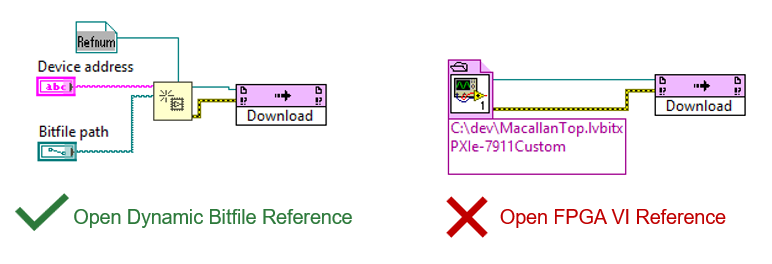

# Talk to the Bitfile from a Host VI

**Goal:** open and run a compiled custom-target bitfile (`.lvbitx`) from a LabVIEW FPGA
host VI, and read/write its registers and DMA FIFOs.

**You'll end up with:** a running host VI that opens the bitfile, so you can exercise the
registers and FIFOs your `UserHdl` exposes.

**Prerequisites:** a built `.lvbitx` for your target (see
[Getting Started → Exercise 1 or 2](GettingStarted.md)) and a target device (or its RIO
resource) you can reach from the host. For the step-by-step walkthrough, see
[Getting Started → Exercise 3](GettingStarted.md#exercise-3---test-the-bitfile-from-a-host-vi-ni-rio-api).

---

## Use *Open Dynamic Bitfile Reference*, not *Open FPGA VI Reference*

With these custom targets you must open the bitfile with **Open Dynamic Bitfile
Reference**. The standard NI-RIO host node **Open FPGA VI Reference** does **not** work —
the custom-target plugin support does not yet integrate with the way that node loads the
`.lvbitx` ([Feature 3736233](https://ni.visualstudio.com/DevCentral/_workitems/edit/3736233)).



> **Symptom of using the wrong node:** when you run the host VI, LabVIEW prompts you to
> locate `niLvFpga_Open_<target>.vi` (for example `niLvFpga_Open_PXIe-7912Custom.vi`) and
> the file is not present under `objects/`. You may also see **Error 7 (file not found)**
> at *Open VI Reference* in `niFpgaRun_LaunchTargetPlugin.vi`. Both mean the bitfile was
> opened with **Open FPGA VI Reference** — switch to **Open Dynamic Bitfile Reference**.

---

## Wire up Open Dynamic Bitfile Reference

1. Drop **Open Dynamic Bitfile Reference** on the host VI block diagram.
2. Wire the **bitfile path** input to your `.lvbitx`.
3. Wire the **device address** (resource name) input to the FPGA target's RIO resource
   (for example `RIO0`, as shown in NI MAX).
4. Wire the **type** input to an **FPGA Interface Dynamic Refnum** constant, then configure
   it to match your bitfile — see the next section. **This configuration step is required**
   and is the most commonly missed one.

The node returns a dynamic FPGA interface reference you then use exactly like a statically
opened reference: **Read/Write Control** (registers), the **DMA FIFO** methods, and
**Close FPGA VI Reference** when you're done.

---

## Configure the Refnum: *Import from bitfile* (required)

The **FPGA Interface Dynamic Refnum** constant must describe the same registers and FIFOs
as the bitfile, or the reference won't resolve and the VI fails to run. The reliable way to
set this up is to import it straight from the bitfile:

1. **Right-click** the FPGA Interface Dynamic Refnum constant.
2. Choose **Configure FPGA VI Reference Interface…**.
3. Click **Import from bitfile…** and select the `.lvbitx` you built.
4. Confirm — the refnum now exposes the bitfile's controls/indicators (registers) and DMA
   FIFOs, and the reference will resolve at run time.

> This is the exact fix for the *"Nonexistent GPIB interface"* / *Error 7* failure at run
> time: the refnum wasn't configured to match the bitfile. Importing from the bitfile
> resolves it.

---

## If the example can't find its helper VIs

When you open one of the shipped host examples (for example `HostExample.vi`), LabVIEW may
be unable to auto-locate helper VIs such as `NiFPGA_HdlFifo_ReadI32.vi`. These live under
the installed dependencies in the target's `deps/` tree (pulled in by `nihdl install-deps`).

- When LabVIEW prompts, point it at the helper VI under the target's `deps/` folder, or add
  that folder to your VI search path (**Tools → Options → Paths → VI Search Path**).
- Make sure you ran `nihdl install-deps` for the target first — the helper VIs are part of
  the installed dependencies, so a target that hasn't installed its deps won't have them.

---

## The shipped host example

Each target ships a host example that already wires all of the above:

```
targets/<target>/docs/Examples/LV2023/HostExample
```

Use the target's [`HostInterfaces.md`](../targets/pxie-7903custom/docs/HostInterfaces.md)
for the register and FIFO map. The common registers are:

| Register | Offset | Access |
| --- | ---: | --- |
| kSignatureOffset | 0 | read-only |
| kVersionOffset | 4 | read-only |
| kOldestCompatibleVersionOffset | 8 | read-only |
| kScratchOffset | 12 | read-write |

---

## Related

- [Getting Started](GettingStarted.md) — build the bitfile first (Exercise 1 or 2).
- [hdl-shared](https://github.com/ni/hdl-shared) — the FPGA-side register & DMA-FIFO blocks behind these host registers/FIFOs: [register guide](https://github.com/ni/hdl-shared/blob/main/host_interfaces/register/docs/instantiation-guide.md) · [DMA-FIFO guide](https://github.com/ni/hdl-shared/blob/main/host_interfaces/fifo/docs/instantiation-guide.md).
- [Digital IO](DigitalIO.md) — the board IO routed into `UserHdl`.
- [Troubleshooting / FAQ](Troubleshooting.md) — other common issues.
- Tool reference:
  [Vivado Compile Flow → Opening the bitfile from a LabVIEW FPGA host VI](https://github.com/ni/labview-fpga-hdl-tools/blob/main/docs/VivadoCompileFlow.md#opening-the-bitfile-from-a-labview-fpga-host-vi).
